# BattleTech Campaign Manager: Database Design and Data Dictionary

**Document Version:** 0.1
**Document Type:** Database Design / ERD / Data Dictionary
**Related Documents:** Clean SRS v0.2, Campaign Gameplay Manual v0.1, Revised Use Cases v0.2

---

# 1. Purpose

This document defines the initial database design for the BattleTech Campaign Manager. It includes:

1. A conceptual entity-relationship design.
2. A draft data dictionary for major tables.
3. Notes on important modeling decisions.
4. Open questions that should be resolved before final implementation.

This is not yet final SQL. It is a planning document meant to clarify the relationships between users, forces, campaigns, battles, objectives, resources, repairs, Conquest maps, and statistics.

---

# 2. Major Database Design Goals

The database must support:

* User accounts and friend relationships.
* Original user-created forces.
* Campaign-specific force copies.
* Campaign participants and invitations.
* Campaign settings for Chaos, Advanced, and Conquest campaigns.
* Battle records and battle submissions.
* Pending, confirmed, and disputed battle states.
* Objective control and objective control history.
* Resource balances and resource transactions.
* Repair, rearmament, and requisition workflows.
* Conquest maps, hexes, combat teams, and orders.
* Notifications.
* Leaderboard/statistics calculations.

The most important architectural decision is that **original forces and campaign-specific forces must be stored separately**. Original forces are templates owned by users. Campaign-specific forces are persistent campaign entities that track damage, kills, repairs, pilot changes, actual BV, and other campaign effects.

---

# 3. High-Level Entity Groups

## 3.1 Account and Social Entities

* users
* friend_requests
* friendships
* notifications

## 3.2 Force Entities

* forces
* force_units
* base_units
* pilots

## 3.3 Campaign Entities

* campaigns
* campaign_settings
* campaign_participants
* campaign_invitations
* campaign_forces
* campaign_units
* campaign_pilots

## 3.4 Battle Entities

* battles
* battle_participants
* battle_units
* battle_submissions
* battle_unit_results
* battle_disputes

## 3.5 Objective and Control Entities

* objectives
* objective_control
* objective_control_history
* objective_bonus_effects

## 3.6 Resource, Repair, and Requisition Entities

* resource_accounts
* resource_transactions
* repair_orders
* repair_order_items
* requisition_requests
* requisition_results

## 3.7 Conquest Entities

* conquest_maps
* conquest_hexes
* combat_teams
* combat_team_units
* conquest_turns
* conquest_orders
* conquest_order_results

## 3.8 Statistics Entities

* leaderboard_snapshots
* statistic_events

---

# 4. Conceptual ERD

```mermaid
erDiagram
    users ||--o{ forces : creates
    users ||--o{ friend_requests : sends
    users ||--o{ friend_requests : receives
    users ||--o{ friendships : has
    users ||--o{ notifications : receives

    forces ||--o{ force_units : contains
    base_units ||--o{ force_units : selected_as
    forces ||--o{ pilots : has

    users ||--o{ campaigns : owns
    campaigns ||--|| campaign_settings : has
    campaigns ||--o{ campaign_participants : includes
    users ||--o{ campaign_participants : joins
    campaigns ||--o{ campaign_invitations : sends
    users ||--o{ campaign_invitations : receives

    campaigns ||--o{ campaign_forces : has
    users ||--o{ campaign_forces : controls
    forces ||--o{ campaign_forces : copied_from
    campaign_forces ||--o{ campaign_units : contains
    base_units ||--o{ campaign_units : based_on
    campaign_forces ||--o{ campaign_pilots : has

    campaigns ||--o{ battles : contains
    battles ||--o{ battle_participants : includes
    campaign_participants ||--o{ battle_participants : participates_as
    battles ||--o{ battle_units : includes
    campaign_units ||--o{ battle_units : appears_in
    battles ||--o{ battle_submissions : has
    users ||--o{ battle_submissions : submits
    battles ||--o{ battle_unit_results : records
    campaign_units ||--o{ battle_unit_results : affected_unit
    battles ||--o{ battle_disputes : may_have

    campaigns ||--o{ objectives : has
    objectives ||--o{ objective_control : has_current_control
    campaign_participants ||--o{ objective_control : holds_control
    objectives ||--o{ objective_control_history : has_history
    objectives ||--o{ objective_bonus_effects : grants

    campaigns ||--o{ resource_accounts : has
    campaign_participants ||--o{ resource_accounts : owns
    resource_accounts ||--o{ resource_transactions : records

    campaign_forces ||--o{ repair_orders : has
    repair_orders ||--o{ repair_order_items : includes
    campaign_units ||--o{ repair_order_items : repairs
    campaigns ||--o{ requisition_requests : has
    requisition_requests ||--o{ requisition_results : produces

    campaigns ||--o| conquest_maps : may_have
    conquest_maps ||--o{ conquest_hexes : contains
    campaign_forces ||--o{ combat_teams : organized_into
    combat_teams ||--o{ combat_team_units : contains
    campaign_units ||--o{ combat_team_units : assigned_to
    campaigns ||--o{ conquest_turns : has
    conquest_turns ||--o{ conquest_orders : contains
    combat_teams ||--o{ conquest_orders : receives
    conquest_orders ||--o{ conquest_order_results : produces

    campaigns ||--o{ leaderboard_snapshots : contributes_to
    battles ||--o{ statistic_events : produces
    campaign_units ||--o{ statistic_events : may_reference
    users ||--o{ statistic_events : may_reference
```

---

# 5. Important Design Decisions

## 5.1 Original Forces vs. Campaign Forces

Original forces are user-owned templates. They represent a player's force outside any specific campaign.

Campaign forces are separate copies made when a force joins a campaign. Campaign forces track campaign-specific changes such as:

* Unit damage.
* Unit kills.
* Pilot changes.
* Repair status.
* Actual BV.
* Full BV.
* Campaign readiness.

Because of this separation, deleting or archiving an original force must not delete its campaign-specific copies.

## 5.2 Base Unit Data vs. Campaign Unit Data

The app should distinguish between:

* **base_units:** Reference/catalog information about a BattleTech unit.
* **force_units:** A user's selected copy of a base unit in an original force.
* **campaign_units:** A campaign-specific persistent copy that tracks damage, status, kills, repair state, and other campaign effects.

This avoids corrupting original unit definitions while allowing campaign damage to persist.

## 5.3 Battle Records vs. Battle Submissions

A battle is the final or pending campaign-level record.

A battle submission is one player's submitted version of the result.

This supports two models:

1. Single-submit confirmation: one player logs a battle and others confirm or dispute it.
2. Dual-submit reconciliation: both players submit results and the system compares them.

## 5.4 Objective Control History

The current control state should be stored separately from historical control changes.

* objective_control = current state.
* objective_control_history = audit/history of changes.

This makes it easier to show how an objective changed hands over time.

## 5.5 Conquest Is Optional Per Campaign

Only Conquest campaigns need Conquest maps, hexes, combat teams, and orders.

The schema should allow campaigns without Conquest records.

## 5.6 Statistics Can Be Derived, But Events Help

Most leaderboards can be calculated from confirmed battles and completed campaigns. However, a statistic_events table can make long-term leaderboard generation easier by recording important normalized events such as:

* Unit kill.
* Unit destroyed.
* Campaign completed.
* Objective captured.
* Battle won.

This can be optional for the first implementation.

---

# 6. Data Dictionary

## 6.1 users

Stores registered user accounts.

| Field             | Type           | Notes                                  |
| ----------------- | -------------- | -------------------------------------- |
| id                | BIGINT PK      | Unique user ID.                        |
| email             | VARCHAR UNIQUE | User login email.                      |
| password_hash     | VARCHAR        | Hashed password.                       |
| display_name      | VARCHAR        | Public or semi-public display name.    |
| friend_code       | VARCHAR UNIQUE | Code used for friend requests.         |
| profile_image_url | VARCHAR NULL   | Optional profile image.                |
| preferred_faction | VARCHAR NULL   | Optional preferred BattleTech faction. |
| role              | ENUM           | user, admin.                           |
| created_at        | DATETIME       | Account creation time.                 |
| updated_at        | DATETIME       | Last update time.                      |
| archived_at       | DATETIME NULL  | Soft delete/archive marker.            |

---

## 6.2 friend_requests

Stores pending or resolved friend requests.

| Field            | Type               | Notes                                   |
| ---------------- | ------------------ | --------------------------------------- |
| id               | BIGINT PK          | Unique request ID.                      |
| sender_user_id   | BIGINT FK users.id | User who sent request.                  |
| receiver_user_id | BIGINT FK users.id | User receiving request.                 |
| status           | ENUM               | pending, accepted, rejected, cancelled. |
| message          | TEXT NULL          | Optional request message.               |
| created_at       | DATETIME           | Request creation time.                  |
| responded_at     | DATETIME NULL      | Time accepted/rejected.                 |

---

## 6.3 friendships

Stores accepted friend relationships.

| Field      | Type               | Notes                     |
| ---------- | ------------------ | ------------------------- |
| id         | BIGINT PK          | Unique friendship ID.     |
| user_a_id  | BIGINT FK users.id | First user.               |
| user_b_id  | BIGINT FK users.id | Second user.              |
| created_at | DATETIME           | Friendship creation time. |
| removed_at | DATETIME NULL      | Soft removal marker.      |

**Constraint:** user_a_id and user_b_id should be normalized or constrained to prevent duplicate reversed friendships.

---

## 6.4 notifications

Stores in-app notifications.

| Field             | Type               | Notes                                                   |
| ----------------- | ------------------ | ------------------------------------------------------- |
| id                | BIGINT PK          | Unique notification ID.                                 |
| recipient_user_id | BIGINT FK users.id | User receiving notification.                            |
| notification_type | VARCHAR            | campaign_invite, battle_pending, battle_confirmed, etc. |
| title             | VARCHAR            | Short notification title.                               |
| message           | TEXT               | Notification text.                                      |
| related_type      | VARCHAR NULL       | Type of related object, such as campaign or battle.     |
| related_id        | BIGINT NULL        | ID of related object.                                   |
| is_read           | BOOLEAN            | Whether notification has been read.                     |
| is_archived       | BOOLEAN            | Whether notification is archived/dismissed.             |
| created_at        | DATETIME           | Notification creation time.                             |
| read_at           | DATETIME NULL      | Time read.                                              |

---

## 6.5 base_units

Stores catalog/reference data for BattleTech units.

| Field         | Type         | Notes                                                       |
| ------------- | ------------ | ----------------------------------------------------------- |
| id            | BIGINT PK    | Unique unit catalog ID.                                     |
| unit_type     | ENUM         | mech, vehicle, infantry, aerospace, etc.                    |
| chassis       | VARCHAR      | Chassis name.                                               |
| model         | VARCHAR      | Variant/model.                                              |
| display_name  | VARCHAR      | Full display name.                                          |
| faction       | VARCHAR NULL | Optional faction association.                               |
| era           | VARCHAR      | Era availability.                                           |
| rules_level   | ENUM         | introductory, standard, advanced, experimental, unofficial. |
| tech_base     | ENUM         | inner_sphere, clan, mixed, unknown.                         |
| tonnage       | DECIMAL      | Unit mass.                                                  |
| bv            | INT          | Battle Value.                                               |
| cost_cbills   | BIGINT NULL  | Optional c-bill cost.                                       |
| source        | VARCHAR NULL | Data source/reference.                                      |
| raw_data_path | VARCHAR NULL | Source file/path if imported.                               |
| created_at    | DATETIME     | Import/creation time.                                       |
| updated_at    | DATETIME     | Last update time.                                           |

---

## 6.6 forces

Stores original user-created forces.

| Field            | Type               | Notes                                |
| ---------------- | ------------------ | ------------------------------------ |
| id               | BIGINT PK          | Unique force ID.                     |
| owner_user_id    | BIGINT FK users.id | User who owns the force.             |
| name             | VARCHAR            | Force name.                          |
| faction          | VARCHAR NULL       | Force faction.                       |
| logo_url         | VARCHAR NULL       | Optional logo.                       |
| background       | TEXT NULL          | Force background/fluff.              |
| era              | VARCHAR NULL       | Force era.                           |
| rules_level      | ENUM NULL          | Allowed rules level.                 |
| bv_limit         | INT NULL           | Max allowed BV.                      |
| current_total_bv | INT                | Current total BV of selected units.  |
| constraints_json | JSON NULL          | Flexible force-building constraints. |
| status           | ENUM               | active, archived, deleted.           |
| created_at       | DATETIME           | Creation time.                       |
| updated_at       | DATETIME           | Last update time.                    |
| archived_at      | DATETIME NULL      | Archive/delete marker.               |

---

## 6.7 force_units

Stores units selected into an original force.

| Field        | Type                    | Notes                                   |
| ------------ | ----------------------- | --------------------------------------- |
| id           | BIGINT PK               | Unique force unit ID.                   |
| force_id     | BIGINT FK forces.id     | Parent original force.                  |
| base_unit_id | BIGINT FK base_units.id | Selected unit template.                 |
| custom_name  | VARCHAR NULL            | Optional unit nickname.                 |
| pilot_name   | VARCHAR NULL            | Simple pilot name before campaign copy. |
| notes        | TEXT NULL               | Optional notes.                         |
| sort_order   | INT NULL                | Display order.                          |
| created_at   | DATETIME                | Added time.                             |
| removed_at   | DATETIME NULL           | Soft removal marker.                    |

---

## 6.8 pilots

Stores optional pilots belonging to original forces.

| Field             | Type                          | Notes                                    |
| ----------------- | ----------------------------- | ---------------------------------------- |
| id                | BIGINT PK                     | Unique pilot ID.                         |
| force_id          | BIGINT FK forces.id           | Parent force.                            |
| force_unit_id     | BIGINT FK force_units.id NULL | Assigned unit if any.                    |
| name              | VARCHAR                       | Pilot name.                              |
| rank              | VARCHAR NULL                  | Optional rank.                           |
| gunnery           | INT NULL                      | Gunnery skill.                           |
| piloting          | INT NULL                      | Piloting skill.                          |
| experience_points | INT DEFAULT 0                 | Optional XP.                             |
| status            | ENUM                          | active, injured, dead, missing, retired. |
| notes             | TEXT NULL                     | Optional notes.                          |

---

## 6.9 campaigns

Stores campaign records.

| Field         | Type               | Notes                                        |
| ------------- | ------------------ | -------------------------------------------- |
| id            | BIGINT PK          | Unique campaign ID.                          |
| owner_user_id | BIGINT FK users.id | Campaign Owner.                              |
| name          | VARCHAR            | Campaign name.                               |
| campaign_type | ENUM               | chaos, advanced, conquest.                   |
| status        | ENUM               | setup, active, paused, finalized, cancelled. |
| visibility    | ENUM               | private, public_summary, public.             |
| description   | TEXT NULL          | Campaign description.                        |
| started_at    | DATETIME NULL      | Campaign start time.                         |
| finalized_at  | DATETIME NULL      | Campaign finalization time.                  |
| created_at    | DATETIME           | Creation time.                               |
| updated_at    | DATETIME           | Last update time.                            |

---

## 6.10 campaign_settings

Stores campaign configuration. One row per campaign.

| Field                     | Type                          | Notes                                             |
| ------------------------- | ----------------------------- | ------------------------------------------------- |
| id                        | BIGINT PK                     | Unique settings ID.                               |
| campaign_id               | BIGINT FK campaigns.id UNIQUE | Parent campaign.                                  |
| scoring_type              | VARCHAR                       | battle_count, domination, objectives, turns, etc. |
| era                       | VARCHAR NULL                  | Campaign era.                                     |
| rules_level               | ENUM NULL                     | Allowed rules level.                              |
| starting_warchest         | INT NULL                      | Chaos starting resource.                          |
| starting_cbills           | BIGINT NULL                   | Advanced/Conquest starting c-bills.               |
| force_bv_limit            | INT NULL                      | Force BV cap.                                     |
| faction_restrictions_json | JSON NULL                     | Faction settings.                                 |
| objective_control_type    | ENUM NULL                     | binary, percentage.                               |
| salaries_enabled          | BOOLEAN DEFAULT false         | Whether salaries are used.                        |
| turn_length_days          | INT NULL                      | Advanced/Conquest turn length.                    |
| max_turns_ahead           | INT NULL                      | Multiplayer pacing limit.                         |
| victory_conditions_json   | JSON NULL                     | Configured victory rules.                         |
| combat_team_size          | INT NULL                      | Conquest combat team size.                        |
| settings_json             | JSON NULL                     | Other flexible settings.                          |

---

## 6.11 campaign_participants

Stores users participating in a campaign.

| Field               | Type                   | Notes                                            |
| ------------------- | ---------------------- | ------------------------------------------------ |
| id                  | BIGINT PK              | Unique participant ID.                           |
| campaign_id         | BIGINT FK campaigns.id | Parent campaign.                                 |
| user_id             | BIGINT FK users.id     | Participating user.                              |
| role                | ENUM                   | owner, participant, moderator.                   |
| status              | ENUM                   | invited, active, declined, removed, surrendered. |
| current_turn_number | INT DEFAULT 0          | Current turn for applicable campaigns.           |
| joined_at           | DATETIME NULL          | Join time.                                       |
| left_at             | DATETIME NULL          | Leave/removal time.                              |

---

## 6.12 campaign_invitations

Stores campaign invitations.

| Field              | Type                   | Notes                                            |
| ------------------ | ---------------------- | ------------------------------------------------ |
| id                 | BIGINT PK              | Unique invitation ID.                            |
| campaign_id        | BIGINT FK campaigns.id | Campaign being joined.                           |
| invited_user_id    | BIGINT FK users.id     | Invited user.                                    |
| invited_by_user_id | BIGINT FK users.id     | User who sent invitation.                        |
| status             | ENUM                   | pending, accepted, declined, cancelled, expired. |
| created_at         | DATETIME               | Invitation time.                                 |
| responded_at       | DATETIME NULL          | Response time.                                   |

---

## 6.13 campaign_forces

Stores campaign-specific force copies.

| Field                   | Type                               | Notes                                                          |
| ----------------------- | ---------------------------------- | -------------------------------------------------------------- |
| id                      | BIGINT PK                          | Unique campaign force ID.                                      |
| campaign_id             | BIGINT FK campaigns.id             | Parent campaign.                                               |
| campaign_participant_id | BIGINT FK campaign_participants.id | Owning participant.                                            |
| source_force_id         | BIGINT FK forces.id NULL           | Original force copied from. Keep nullable if original deleted. |
| name                    | VARCHAR                            | Campaign force name.                                           |
| faction                 | VARCHAR NULL                       | Campaign force faction.                                        |
| logo_url                | VARCHAR NULL                       | Force logo at campaign time.                                   |
| full_bv                 | INT                                | Fully repaired BV.                                             |
| actual_bv               | INT                                | Current effective BV.                                          |
| status                  | ENUM                               | active, defeated, surrendered, archived.                       |
| copied_at               | DATETIME                           | Time force was copied into campaign.                           |
| updated_at              | DATETIME                           | Last campaign force update.                                    |

---

## 6.14 campaign_units

Stores campaign-specific unit copies and persistent unit state.

| Field                | Type                              | Notes                                                                   |
| -------------------- | --------------------------------- | ----------------------------------------------------------------------- |
| id                   | BIGINT PK                         | Unique campaign unit ID.                                                |
| campaign_force_id    | BIGINT FK campaign_forces.id      | Parent campaign force.                                                  |
| source_force_unit_id | BIGINT FK force_units.id NULL     | Source unit if retained.                                                |
| base_unit_id         | BIGINT FK base_units.id           | Base unit template.                                                     |
| display_name         | VARCHAR                           | Unit display name at campaign time.                                     |
| custom_name          | VARCHAR NULL                      | Unit nickname.                                                          |
| pilot_id             | BIGINT FK campaign_pilots.id NULL | Assigned campaign pilot.                                                |
| full_bv              | INT                               | Fully repaired BV.                                                      |
| actual_bv            | INT                               | Current effective BV.                                                   |
| status               | ENUM                              | active, damaged, destroyed, captured, salvaged, unavailable, repairing. |
| damage_summary       | ENUM NULL                         | none, light, moderate, heavy, destroyed.                                |
| damage_json          | JSON NULL                         | Detailed damage state for advanced campaigns.                           |
| ammo_status_json     | JSON NULL                         | Rearm/ammo status.                                                      |
| kills                | INT DEFAULT 0                     | Confirmed unit kills.                                                   |
| notes                | TEXT NULL                         | Campaign notes.                                                         |
| created_at           | DATETIME                          | Campaign copy creation time.                                            |
| updated_at           | DATETIME                          | Last update time.                                                       |

---

## 6.15 campaign_pilots

Stores campaign-specific pilot state.

| Field             | Type                         | Notes                                              |
| ----------------- | ---------------------------- | -------------------------------------------------- |
| id                | BIGINT PK                    | Unique campaign pilot ID.                          |
| campaign_force_id | BIGINT FK campaign_forces.id | Parent campaign force.                             |
| source_pilot_id   | BIGINT FK pilots.id NULL     | Original pilot if copied.                          |
| name              | VARCHAR                      | Pilot name.                                        |
| rank              | VARCHAR NULL                 | Rank.                                              |
| gunnery           | INT NULL                     | Gunnery skill.                                     |
| piloting          | INT NULL                     | Piloting skill.                                    |
| experience_points | INT DEFAULT 0                | XP.                                                |
| status            | ENUM                         | active, injured, dead, missing, captured, retired. |
| injury_json       | JSON NULL                    | Injury details if supported.                       |
| kills             | INT DEFAULT 0                | Pilot kills.                                       |
| notes             | TEXT NULL                    | Notes.                                             |

---

## 6.16 battles

Stores battle records.

| Field                  | Type                                    | Notes                                                     |
| ---------------------- | --------------------------------------- | --------------------------------------------------------- |
| id                     | BIGINT PK                               | Unique battle ID.                                         |
| campaign_id            | BIGINT FK campaigns.id                  | Parent campaign.                                          |
| created_by_user_id     | BIGINT FK users.id                      | User who created/logged battle.                           |
| related_objective_id   | BIGINT FK objectives.id NULL            | Objective fought over, if any.                            |
| related_hex_id         | BIGINT FK conquest_hexes.id NULL        | Conquest hex, if any.                                     |
| battle_number          | INT NULL                                | Campaign battle sequence.                                 |
| battle_date            | DATE NULL                               | Date battle occurred.                                     |
| scenario_type          | VARCHAR NULL                            | Scenario type.                                            |
| map_name               | VARCHAR NULL                            | Map or battlefield reference.                             |
| status                 | ENUM                                    | draft, pending_confirmation, confirmed, disputed, voided. |
| outcome_type           | ENUM                                    | win_loss, draw, objective_result, custom.                 |
| winner_participant_id  | BIGINT FK campaign_participants.id NULL | Winner if applicable.                                     |
| loser_participant_id   | BIGINT FK campaign_participants.id NULL | Loser if applicable.                                      |
| summary                | TEXT NULL                               | Battle report summary.                                    |
| projected_effects_json | JSON NULL                               | Effects if confirmed.                                     |
| confirmed_at           | DATETIME NULL                           | Confirmation time.                                        |
| created_at             | DATETIME                                | Created time.                                             |
| updated_at             | DATETIME                                | Last update time.                                         |

---

## 6.17 battle_participants

Stores campaign participants involved in a battle.

| Field                   | Type                               | Notes                                     |
| ----------------------- | ---------------------------------- | ----------------------------------------- |
| id                      | BIGINT PK                          | Unique row ID.                            |
| battle_id               | BIGINT FK battles.id               | Parent battle.                            |
| campaign_participant_id | BIGINT FK campaign_participants.id | Participant involved.                     |
| role_in_battle          | ENUM                               | attacker, defender, neutral, ally, other. |
| result                  | ENUM NULL                          | won, lost, draw, withdrew, unknown.       |

---

## 6.18 battle_units

Stores units selected as participating in a battle.

| Field                   | Type                               | Notes                        |
| ----------------------- | ---------------------------------- | ---------------------------- |
| id                      | BIGINT PK                          | Unique battle-unit row.      |
| battle_id               | BIGINT FK battles.id               | Parent battle.               |
| campaign_unit_id        | BIGINT FK campaign_units.id        | Participating unit.          |
| campaign_participant_id | BIGINT FK campaign_participants.id | Owner participant.           |
| starting_status_json    | JSON NULL                          | Unit status at battle start. |
| ending_status_json      | JSON NULL                          | Unit status at battle end.   |
| was_destroyed           | BOOLEAN DEFAULT false              | Whether destroyed.           |
| was_captured            | BOOLEAN DEFAULT false              | Whether captured.            |
| was_salvaged            | BOOLEAN DEFAULT false              | Whether salvaged.            |

---

## 6.19 battle_submissions

Stores submitted battle logs for reconciliation.

| Field                 | Type                                    | Notes                                               |
| --------------------- | --------------------------------------- | --------------------------------------------------- |
| id                    | BIGINT PK                               | Unique submission ID.                               |
| battle_id             | BIGINT FK battles.id                    | Parent battle.                                      |
| submitted_by_user_id  | BIGINT FK users.id                      | User who submitted.                                 |
| submission_status     | ENUM                                    | submitted, matched, conflict, corrected, withdrawn. |
| winner_participant_id | BIGINT FK campaign_participants.id NULL | Submitted winner.                                   |
| loser_participant_id  | BIGINT FK campaign_participants.id NULL | Submitted loser.                                    |
| objective_id          | BIGINT FK objectives.id NULL            | Submitted objective.                                |
| submission_json       | JSON                                    | Full submitted result data.                         |
| conflict_summary_json | JSON NULL                               | Discrepancies found.                                |
| submitted_at          | DATETIME                                | Submission time.                                    |
| updated_at            | DATETIME                                | Last update.                                        |

---

## 6.20 battle_unit_results

Stores specific unit-level battle effects.

| Field                      | Type                             | Notes                                                                          |
| -------------------------- | -------------------------------- | ------------------------------------------------------------------------------ |
| id                         | BIGINT PK                        | Unique result ID.                                                              |
| battle_id                  | BIGINT FK battles.id             | Parent battle.                                                                 |
| campaign_unit_id           | BIGINT FK campaign_units.id      | Affected unit.                                                                 |
| result_type                | ENUM                             | damage, kill, destroyed, disabled, captured, salvaged, repaired_status_change. |
| caused_by_campaign_unit_id | BIGINT FK campaign_units.id NULL | Unit responsible, if applicable.                                               |
| damage_category            | ENUM NULL                        | light, moderate, heavy, destroyed.                                             |
| detail_json                | JSON NULL                        | Detailed result data.                                                          |
| created_at                 | DATETIME                         | Creation time.                                                                 |

---

## 6.21 battle_disputes

Stores disputes for battle records.

| Field               | Type                    | Notes                                |
| ------------------- | ----------------------- | ------------------------------------ |
| id                  | BIGINT PK               | Unique dispute ID.                   |
| battle_id           | BIGINT FK battles.id    | Disputed battle.                     |
| opened_by_user_id   | BIGINT FK users.id      | User who disputed.                   |
| status              | ENUM                    | open, resolved, rejected, cancelled. |
| reason              | TEXT                    | Dispute explanation.                 |
| resolution_notes    | TEXT NULL               | Final notes.                         |
| resolved_by_user_id | BIGINT FK users.id NULL | Resolver.                            |
| created_at          | DATETIME                | Opened time.                         |
| resolved_at         | DATETIME NULL           | Resolved time.                       |

---

## 6.22 objectives

Stores campaign objectives.

| Field          | Type                   | Notes                                                                                           |
| -------------- | ---------------------- | ----------------------------------------------------------------------------------------------- |
| id             | BIGINT PK              | Unique objective ID.                                                                            |
| campaign_id    | BIGINT FK campaigns.id | Parent campaign.                                                                                |
| objective_type | ENUM                   | factory, depot, comms_array, city, fort, repair_facility, space_port, medical_facility, custom. |
| name           | VARCHAR                | Objective name.                                                                                 |
| description    | TEXT NULL              | Objective description.                                                                          |
| control_type   | ENUM                   | binary, percentage.                                                                             |
| bonus_summary  | TEXT NULL              | Human-readable bonus.                                                                           |
| bonus_json     | JSON NULL              | Machine-readable bonus rules.                                                                   |
| is_hidden      | BOOLEAN DEFAULT false  | Relevant for Conquest.                                                                          |
| created_at     | DATETIME               | Created time.                                                                                   |

---

## 6.23 objective_control

Stores current objective control state.

| Field                   | Type                               | Notes                                              |
| ----------------------- | ---------------------------------- | -------------------------------------------------- |
| id                      | BIGINT PK                          | Unique control row.                                |
| objective_id            | BIGINT FK objectives.id            | Parent objective.                                  |
| campaign_participant_id | BIGINT FK campaign_participants.id | Controlling participant.                           |
| control_percent         | DECIMAL(5,2)                       | 0.00 to 100.00. For binary, winner may be 100.     |
| is_current_controller   | BOOLEAN                            | Whether this participant currently receives bonus. |
| updated_at              | DATETIME                           | Last update time.                                  |

**Constraint:** For percentage control, total control across participants for an objective should equal 100 unless a neutral/uncontrolled row is modeled separately.

---

## 6.24 objective_control_history

Stores objective control changes over time.

| Field               | Type                                    | Notes                                                          |
| ------------------- | --------------------------------------- | -------------------------------------------------------------- |
| id                  | BIGINT PK                               | Unique history ID.                                             |
| objective_id        | BIGINT FK objectives.id                 | Objective affected.                                            |
| battle_id           | BIGINT FK battles.id NULL               | Battle causing change, if any.                                 |
| from_participant_id | BIGINT FK campaign_participants.id NULL | Control loser.                                                 |
| to_participant_id   | BIGINT FK campaign_participants.id NULL | Control winner.                                                |
| control_delta       | DECIMAL(5,2)                            | Percentage moved.                                              |
| before_json         | JSON                                    | Control state before.                                          |
| after_json          | JSON                                    | Control state after.                                           |
| reason              | VARCHAR                                 | battle_result, setup, admin_adjustment, order_resolution, etc. |
| created_at          | DATETIME                                | Change time.                                                   |

---

## 6.25 resource_accounts

Stores resource balances for campaign participants.

| Field                   | Type                               | Notes                                                 |
| ----------------------- | ---------------------------------- | ----------------------------------------------------- |
| id                      | BIGINT PK                          | Unique resource account ID.                           |
| campaign_id             | BIGINT FK campaigns.id             | Parent campaign.                                      |
| campaign_participant_id | BIGINT FK campaign_participants.id | Owner.                                                |
| resource_type           | ENUM                               | warchest, cbills, support_points, reputation, custom. |
| balance                 | BIGINT                             | Current balance.                                      |
| updated_at              | DATETIME                           | Last update.                                          |

---

## 6.26 resource_transactions

Stores resource changes.

| Field               | Type                           | Notes                                                                      |
| ------------------- | ------------------------------ | -------------------------------------------------------------------------- |
| id                  | BIGINT PK                      | Unique transaction ID.                                                     |
| resource_account_id | BIGINT FK resource_accounts.id | Account affected.                                                          |
| amount              | BIGINT                         | Positive or negative amount.                                               |
| transaction_type    | ENUM                           | income, repair_cost, purchase, sale, objective_bonus, penalty, adjustment. |
| related_type        | VARCHAR NULL                   | battle, objective, repair_order, requisition, admin_adjustment, etc.       |
| related_id          | BIGINT NULL                    | Related object ID.                                                         |
| description         | TEXT NULL                      | Explanation.                                                               |
| created_at          | DATETIME                       | Transaction time.                                                          |

---

## 6.27 repair_orders

Stores broad repair/rearm actions for a force or combat team.

| Field                  | Type                           | Notes                                                                                                                             |
| ---------------------- | ------------------------------ | --------------------------------------------------------------------------------------------------------------------------------- |
| id                     | BIGINT PK                      | Unique repair order ID.                                                                                                           |
| campaign_id            | BIGINT FK campaigns.id         | Parent campaign.                                                                                                                  |
| campaign_force_id      | BIGINT FK campaign_forces.id   | Force being repaired.                                                                                                             |
| combat_team_id         | BIGINT FK combat_teams.id NULL | Relevant for Conquest.                                                                                                            |
| created_by_user_id     | BIGINT FK users.id             | User selecting repair.                                                                                                            |
| repair_type            | ENUM                           | chaos_full_repair, general_priority, armor_structure, limbs_components, weapons, scrounge_salvage, field_repair, facility_repair. |
| status                 | ENUM                           | planned, in_progress, completed, failed, cancelled.                                                                               |
| time_available_minutes | INT NULL                       | Advanced/Conquest repair time.                                                                                                    |
| resource_cost          | BIGINT NULL                    | Cost if known.                                                                                                                    |
| started_at             | DATETIME NULL                  | Start time.                                                                                                                       |
| completed_at           | DATETIME NULL                  | Completion time.                                                                                                                  |
| summary_json           | JSON NULL                      | Results summary.                                                                                                                  |

---

## 6.28 repair_order_items

Stores unit-level repair/rearm results.

| Field              | Type                        | Notes                                                                                              |
| ------------------ | --------------------------- | -------------------------------------------------------------------------------------------------- |
| id                 | BIGINT PK                   | Unique repair item ID.                                                                             |
| repair_order_id    | BIGINT FK repair_orders.id  | Parent repair order.                                                                               |
| campaign_unit_id   | BIGINT FK campaign_units.id | Unit repaired.                                                                                     |
| action_type        | ENUM                        | rearm, armor_repair, structure_repair, limb_replace, weapon_replace, component_repair, pilot_heal. |
| status             | ENUM                        | pending, success, failed, delayed, skipped.                                                        |
| time_spent_minutes | INT NULL                    | Time spent.                                                                                        |
| cost               | BIGINT NULL                 | Resource/c-bill cost.                                                                              |
| result_json        | JSON NULL                   | Detailed result.                                                                                   |

---

## 6.29 requisition_requests

Stores requests for parts, units, pilots, or supplies.

| Field                   | Type                               | Notes                                                         |
| ----------------------- | ---------------------------------- | ------------------------------------------------------------- |
| id                      | BIGINT PK                          | Unique requisition ID.                                        |
| campaign_id             | BIGINT FK campaigns.id             | Parent campaign.                                              |
| campaign_participant_id | BIGINT FK campaign_participants.id | Requesting participant.                                       |
| request_type            | ENUM                               | part, component, weapon, limb, unit, pilot, supplies, custom. |
| target_base_unit_id     | BIGINT FK base_units.id NULL       | Relevant if requesting a unit.                                |
| description             | TEXT                               | What is requested.                                            |
| status                  | ENUM                               | pending, approved, denied, delayed, fulfilled, cancelled.     |
| requested_at            | DATETIME                           | Request time.                                                 |
| resolved_at             | DATETIME NULL                      | Resolution time.                                              |

---

## 6.30 requisition_results

Stores result of a requisition request.

| Field                  | Type                              | Notes                                |
| ---------------------- | --------------------------------- | ------------------------------------ |
| id                     | BIGINT PK                         | Unique requisition result ID.        |
| requisition_request_id | BIGINT FK requisition_requests.id | Parent request.                      |
| success                | BOOLEAN                           | Whether fulfilled.                   |
| cost                   | BIGINT NULL                       | Cost paid.                           |
| delivery_turn          | INT NULL                          | Turn delivered.                      |
| availability_modifier  | INT NULL                          | Modifier from objective/faction/etc. |
| result_notes           | TEXT NULL                         | Notes.                               |
| result_json            | JSON NULL                         | Detailed result.                     |
| created_at             | DATETIME                          | Result time.                         |

---

## 6.31 conquest_maps

Stores Conquest campaign maps.

| Field           | Type                          | Notes                                  |
| --------------- | ----------------------------- | -------------------------------------- |
| id              | BIGINT PK                     | Unique map ID.                         |
| campaign_id     | BIGINT FK campaigns.id UNIQUE | Parent campaign.                       |
| name            | VARCHAR                       | Map name.                              |
| map_type        | VARCHAR NULL                  | planet, region, theater, custom.       |
| width           | INT NULL                      | Optional map width.                    |
| height          | INT NULL                      | Optional map height.                   |
| map_config_json | JSON NULL                     | Flexible map generation/configuration. |
| created_at      | DATETIME                      | Created time.                          |

---

## 6.32 conquest_hexes

Stores hexes for Conquest campaigns.

| Field                | Type                                    | Notes                        |
| -------------------- | --------------------------------------- | ---------------------------- |
| id                   | BIGINT PK                               | Unique hex ID.               |
| conquest_map_id      | BIGINT FK conquest_maps.id              | Parent map.                  |
| q                    | INT                                     | Axial/cube coordinate q.     |
| r                    | INT                                     | Axial/cube coordinate r.     |
| terrain_type         | VARCHAR NULL                            | Optional terrain.            |
| owner_participant_id | BIGINT FK campaign_participants.id NULL | Current owner.               |
| objective_id         | BIGINT FK objectives.id NULL            | Objective on this hex.       |
| is_hidden            | BOOLEAN DEFAULT false                   | Whether hidden from players. |
| is_base_hex          | BOOLEAN DEFAULT false                   | Base/dropship hex marker.    |
| created_at           | DATETIME                                | Created time.                |
| updated_at           | DATETIME                                | Last update.                 |

---

## 6.33 combat_teams

Stores Conquest combat teams.

| Field             | Type                             | Notes                                               |
| ----------------- | -------------------------------- | --------------------------------------------------- |
| id                | BIGINT PK                        | Unique combat team ID.                              |
| campaign_force_id | BIGINT FK campaign_forces.id     | Parent campaign force.                              |
| name              | VARCHAR                          | Combat team name.                                   |
| team_type         | ENUM                             | lance, star, custom.                                |
| current_hex_id    | BIGINT FK conquest_hexes.id NULL | Current map position.                               |
| full_bv           | INT                              | Fully repaired BV.                                  |
| actual_bv         | INT                              | Current effective BV.                               |
| status            | ENUM                             | active, repairing, reserve, unavailable, destroyed. |
| created_at        | DATETIME                         | Created time.                                       |
| updated_at        | DATETIME                         | Last update.                                        |

---

## 6.34 combat_team_units

Links campaign units to combat teams.

| Field            | Type                        | Notes               |
| ---------------- | --------------------------- | ------------------- |
| id               | BIGINT PK                   | Unique row ID.      |
| combat_team_id   | BIGINT FK combat_teams.id   | Parent combat team. |
| campaign_unit_id | BIGINT FK campaign_units.id | Assigned unit.      |
| assigned_at      | DATETIME                    | Assignment time.    |
| removed_at       | DATETIME NULL               | Removal time.       |

---

## 6.35 conquest_turns

Stores Conquest turn records.

| Field        | Type                   | Notes                                                                        |
| ------------ | ---------------------- | ---------------------------------------------------------------------------- |
| id           | BIGINT PK              | Unique turn ID.                                                              |
| campaign_id  | BIGINT FK campaigns.id | Parent campaign.                                                             |
| turn_number  | INT                    | Turn number.                                                                 |
| status       | ENUM                   | waiting_for_orders, orders_submitted, resolving, battles_pending, completed. |
| started_at   | DATETIME               | Turn start.                                                                  |
| resolved_at  | DATETIME NULL          | Resolution time.                                                             |
| summary_json | JSON NULL              | Turn summary.                                                                |

---

## 6.36 conquest_orders

Stores combat team orders for a Conquest turn.

| Field               | Type                             | Notes                                                                                                          |
| ------------------- | -------------------------------- | -------------------------------------------------------------------------------------------------------------- |
| id                  | BIGINT PK                        | Unique order ID.                                                                                               |
| conquest_turn_id    | BIGINT FK conquest_turns.id      | Parent turn.                                                                                                   |
| combat_team_id      | BIGINT FK combat_teams.id        | Team receiving order.                                                                                          |
| issued_by_user_id   | BIGINT FK users.id               | User issuing order.                                                                                            |
| order_type          | ENUM                             | seize_territory, attack_objective, patrol, recon, raid, defend, field_repair_rearm, facility_repairs, reserve. |
| target_hex_id       | BIGINT FK conquest_hexes.id NULL | Target hex.                                                                                                    |
| target_objective_id | BIGINT FK objectives.id NULL     | Target objective if applicable.                                                                                |
| status              | ENUM                             | draft, submitted, locked, resolved, cancelled.                                                                 |
| order_data_json     | JSON NULL                        | Extra details.                                                                                                 |
| submitted_at        | DATETIME NULL                    | Submission time.                                                                                               |
| resolved_at         | DATETIME NULL                    | Resolution time.                                                                                               |

---

## 6.37 conquest_order_results

Stores results from Conquest order resolution.

| Field                 | Type                             | Notes                                                                                                     |
| --------------------- | -------------------------------- | --------------------------------------------------------------------------------------------------------- |
| id                    | BIGINT PK                        | Unique result ID.                                                                                         |
| conquest_order_id     | BIGINT FK conquest_orders.id     | Parent order.                                                                                             |
| result_type           | ENUM                             | hex_gained, objective_attacked, battle_triggered, repair_completed, raid_success, raid_failed, no_effect. |
| affected_hex_id       | BIGINT FK conquest_hexes.id NULL | Affected hex.                                                                                             |
| affected_objective_id | BIGINT FK objectives.id NULL     | Affected objective.                                                                                       |
| generated_battle_id   | BIGINT FK battles.id NULL        | Battle created by result.                                                                                 |
| roll_value            | INT NULL                         | Dice roll if applicable.                                                                                  |
| modifiers_json        | JSON NULL                        | Applied modifiers.                                                                                        |
| result_json           | JSON NULL                        | Detailed result.                                                                                          |
| created_at            | DATETIME                         | Result time.                                                                                              |

---

## 6.38 leaderboard_snapshots

Stores optional precomputed leaderboard results.

| Field         | Type      | Notes                                    |
| ------------- | --------- | ---------------------------------------- |
| id            | BIGINT PK | Unique snapshot ID.                      |
| snapshot_type | VARCHAR   | best_player, best_unit, most_kills, etc. |
| scope         | ENUM      | global, campaign_type, era, faction.     |
| data_json     | JSON      | Snapshot data.                           |
| generated_at  | DATETIME  | Generation time.                         |

---

## 6.39 statistic_events

Stores normalized statistical events that can feed leaderboards.

| Field            | Type                             | Notes                                                                                       |
| ---------------- | -------------------------------- | ------------------------------------------------------------------------------------------- |
| id               | BIGINT PK                        | Unique event ID.                                                                            |
| event_type       | ENUM                             | battle_completed, unit_kill, unit_destroyed, objective_control_changed, campaign_finalized. |
| campaign_id      | BIGINT FK campaigns.id NULL      | Related campaign.                                                                           |
| battle_id        | BIGINT FK battles.id NULL        | Related battle.                                                                             |
| user_id          | BIGINT FK users.id NULL          | Related user.                                                                               |
| campaign_unit_id | BIGINT FK campaign_units.id NULL | Related unit.                                                                               |
| faction          | VARCHAR NULL                     | Related faction.                                                                            |
| value            | DECIMAL NULL                     | Numeric value if relevant.                                                                  |
| event_json       | JSON NULL                        | Additional data.                                                                            |
| created_at       | DATETIME                         | Event time.                                                                                 |

---

# 7. Suggested Indexes and Constraints

## 7.1 Important Unique Constraints

* users.email unique.
* users.friend_code unique.
* campaign_settings.campaign_id unique.
* conquest_maps.campaign_id unique.
* friendships should prevent duplicate user pairs.
* campaign_participants should prevent the same user from joining the same campaign more than once as active.
* objective_control should prevent duplicate objective/player current-control rows.

## 7.2 Important Indexes

Suggested indexes:

* forces.owner_user_id
* force_units.force_id
* campaigns.owner_user_id
* campaigns.status
* campaigns.campaign_type
* campaign_participants.campaign_id
* campaign_participants.user_id
* campaign_forces.campaign_id
* campaign_forces.campaign_participant_id
* campaign_units.campaign_force_id
* battles.campaign_id
* battles.status
* battle_submissions.battle_id
* objectives.campaign_id
* objective_control.objective_id
* resource_accounts.campaign_participant_id
* conquest_hexes.conquest_map_id
* combat_teams.campaign_force_id
* conquest_orders.conquest_turn_id
* notifications.recipient_user_id
* notifications.is_read

---

# 8. Implementation Notes

## 8.1 Use ENUMs Carefully

ENUMs are useful for readability, but if values may change often, lookup tables may be better.

Likely stable ENUMs:

* campaign_type
* campaign_status
* battle_status
* notification read/unread flags

Likely flexible lookup-table candidates:

* objective_type
* order_type
* resource_type
* repair_type
* rules_level

## 8.2 JSON Fields Are Useful but Should Not Hide Core Relationships

JSON fields are helpful for flexible rule settings and detailed damage state, but core relationships should remain relational.

Good JSON candidates:

* campaign_settings.settings_json
* force.constraints_json
* campaign_units.damage_json
* battle_submissions.submission_json
* conquest_order_results.modifiers_json

Avoid storing important searchable relationships only in JSON.

## 8.3 Soft Deletes Are Recommended

Soft deletes or archives are recommended for:

* users
* forces
* friendships
* campaigns
* battle records

Campaign history should generally be preserved.

## 8.4 Rule Constants May Need Their Own Table Later

Admin-configurable constants could later be stored in:

* rule_constants
* campaign_rule_overrides

This draft does not define those tables fully yet, but they should be added if admin configuration becomes part of the implemented system.

Suggested future table:

| Table                   | Purpose                                                |
| ----------------------- | ------------------------------------------------------ |
| rule_constants          | Global default values for formulas and modifiers.      |
| campaign_rule_overrides | Campaign-specific copies or overrides of those values. |

---

# 9. Open Database Questions

## 9.1 How Detailed Should Unit Damage Be?

Options:

1. Simple damage category only.
2. JSON damage object.
3. Fully normalized component-level damage tables.

Recommendation for first implementation:

* Use damage_summary plus damage_json.
* Normalize later only if needed.

## 9.2 Should Base Unit Data Be Fully Imported?

Options:

1. Store only basic fields needed for filtering.
2. Store full unit data.
3. Store references to imported source files.

Recommendation:

* Start with basic searchable/filterable fields.
* Store raw_data_path or source reference for future expansion.

## 9.3 Should Battle Reconciliation Be Mandatory?

Options:

1. Single-submit confirmation only.
2. Dual-submit reconciliation only.
3. Campaign setting chooses model.

Recommendation:

* Support both conceptually.
* Implement single-submit first.
* Add dual-submit reconciliation for Chaos/Advanced once battle logging is stable.

## 9.4 How Should Objective Bonuses Be Modeled?

Options:

1. Hard-code objective type effects.
2. Store bonus_json per objective.
3. Use objective_bonus_effects table.

Recommendation:

* Start with bonus_json for flexibility.
* Add objective_bonus_effects table later if bonuses need to be queried or audited heavily.

## 9.5 Should Leaderboards Be Live or Precomputed?

Options:

1. Query confirmed/completed data live.
2. Use statistic_events.
3. Use leaderboard_snapshots.

Recommendation:

* Query live early.
* Add statistic_events or snapshots when performance or complexity requires it.

---

# 10. First Implementation Priority

For an initial working version, implement database tables in this order:

## Phase 1: Accounts and Forces

1. users
2. friend_requests
3. friendships
4. notifications
5. base_units
6. forces
7. force_units
8. pilots

## Phase 2: Campaign Setup

9. campaigns
10. campaign_settings
11. campaign_participants
12. campaign_invitations
13. campaign_forces
14. campaign_units
15. campaign_pilots

## Phase 3: Battles

16. battles
17. battle_participants
18. battle_units
19. battle_submissions
20. battle_unit_results
21. battle_disputes

## Phase 4: Objectives and Resources

22. objectives
23. objective_control
24. objective_control_history
25. resource_accounts
26. resource_transactions

## Phase 5: Repair and Requisition

27. repair_orders
28. repair_order_items
29. requisition_requests
30. requisition_results

## Phase 6: Conquest

31. conquest_maps
32. conquest_hexes
33. combat_teams
34. combat_team_units
35. conquest_turns
36. conquest_orders
37. conquest_order_results

## Phase 7: Statistics

38. leaderboard_snapshots
39. statistic_events

---

# 11. Simplified MVP Schema

If the full design is too large for the first implementation, the MVP database can start with:

* users
* friendships
* notifications
* base_units
* forces
* force_units
* campaigns
* campaign_settings
* campaign_participants
* campaign_invitations
* campaign_forces
* campaign_units
* battles
* battle_participants
* battle_units
* battle_submissions
* objectives
* objective_control
* resource_accounts
* resource_transactions

This MVP would support:

* Accounts and friends.
* Original forces.
* Campaign creation.
* Campaign-specific force copies.
* Basic battle logging.
* Battle confirmation.
* Basic objective control.
* Basic Chaos campaign resource tracking.

Advanced repairs, requisition, Conquest map play, and detailed leaderboards can be added later.
