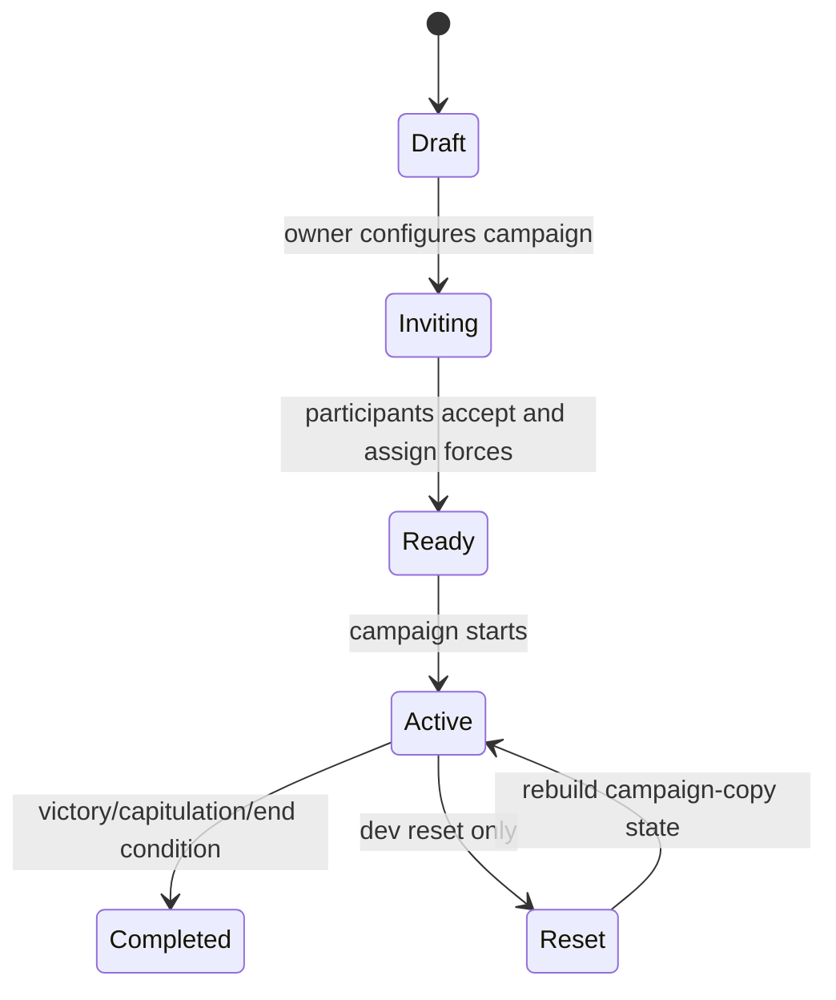
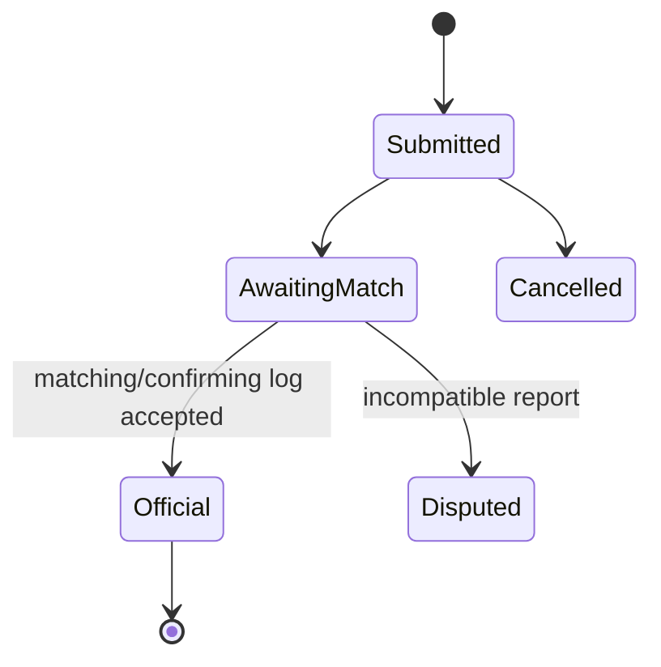
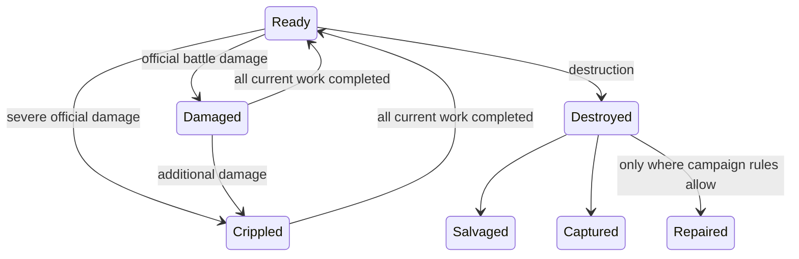
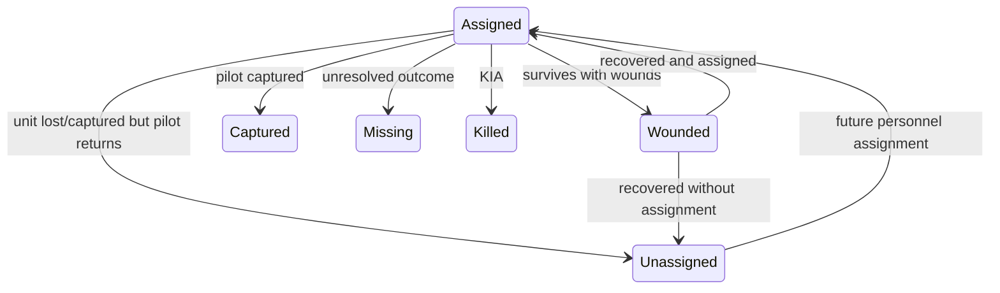
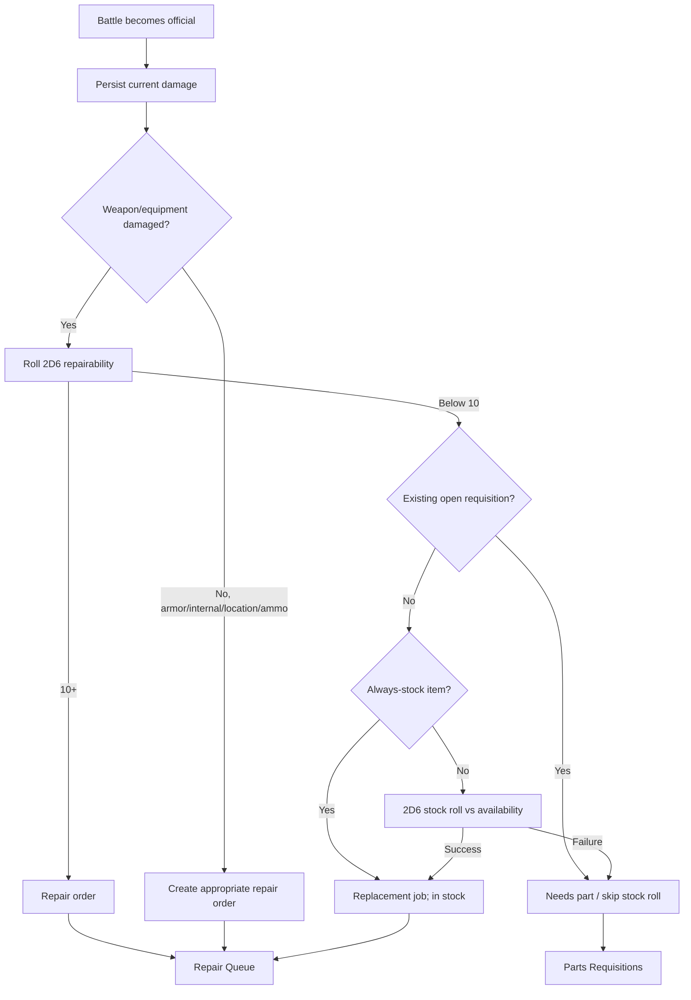
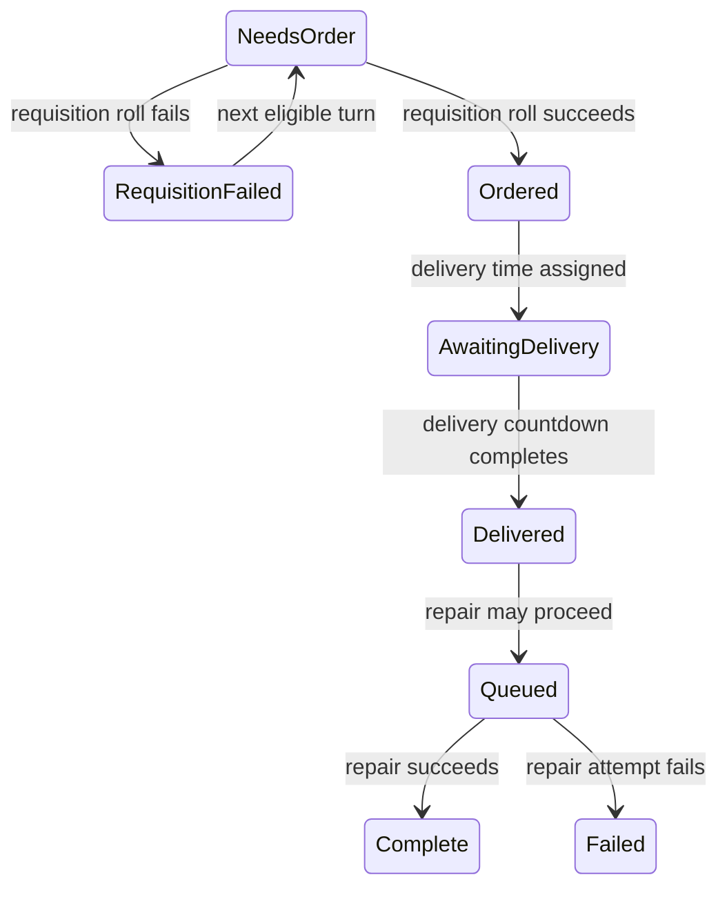
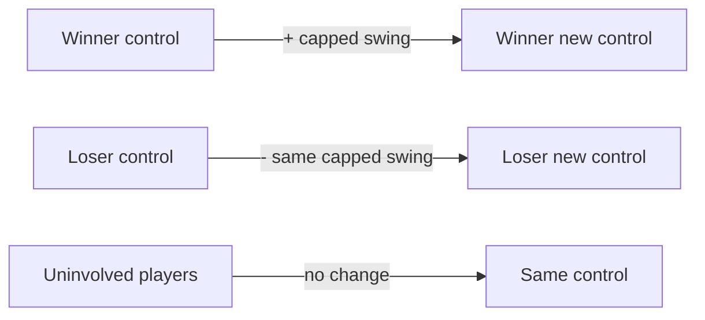

# Lifecycle and State Diagrams

**Current baseline:** v71

## Campaign lifecycle



## Battle-log lifecycle



On `Official`, the system updates turns, objective control, force-unit condition, current BV, pilots, resources, current damage, and repair orders.

## Force-unit condition



A destroyed Center Torso is a terminal salvage-only condition for the current Advanced/Conquest workflow. It cannot be repaired or sold.

## Pilot lifecycle



No replacement pilot is automatically created when a pilot is killed or a unit is captured.

## Damage-to-repair lifecycle



## Future between-turn requisition lifecycle



## Objective percentage transfer



## Campaign reset lifecycle

The dev reset is a rebuild, not a field-by-field reversal:

```text
remove campaign battles/damage/orders/resources/pilots/current units
    -> retain participant and campaign-copy force IDs
    -> copy units and pilots from original forces
    -> restore starting resources
    -> reset objective/planet control
    -> reset campaign/player turns
    -> audit relationships
```
