# BattleTech Campaign Manager: Lifecycle and State Diagrams

**Document Version:** 0.1
**Document Type:** State / Lifecycle Design
**Related Documents:** Clean SRS v0.2, Campaign Gameplay Manual v0.1, Revised Use Cases v0.2, Database Design and Data Dictionary v0.1

---

# 1. Purpose

This document defines the major lifecycle and state transitions used by the BattleTech Campaign Manager.

The purpose is to clarify how key records move through the system before implementation begins. This helps prevent unclear behavior around campaign setup, battle confirmation, campaign-specific force copies, repairs, Conquest turns, and finalization.

---

# 2. State Diagrams Included

This document includes lifecycle models for:

1. Campaign lifecycle.
2. Campaign invitation lifecycle.
3. Original force lifecycle.
4. Campaign-specific force lifecycle.
5. Campaign unit lifecycle.
6. Battle lifecycle.
7. Battle submission lifecycle.
8. Battle dispute lifecycle.
9. Objective control lifecycle.
10. Resource transaction lifecycle.
11. Repair order lifecycle.
12. Requisition lifecycle.
13. Conquest turn lifecycle.
14. Conquest order lifecycle.
15. Notification lifecycle.

---

# 3. Campaign Lifecycle

## 3.1 Description

A campaign begins in setup, becomes active when required players and forces are ready, and eventually becomes finalized, cancelled, or paused.

## 3.2 States

| State     | Meaning                                                       |
| --------- | ------------------------------------------------------------- |
| setup     | Campaign has been created but is not ready to begin.          |
| active    | Campaign is running and players may perform campaign actions. |
| paused    | Campaign is temporarily halted.                               |
| finalized | Campaign is complete and mostly read-only.                    |
| cancelled | Campaign was abandoned before completion.                     |

## 3.3 Diagram

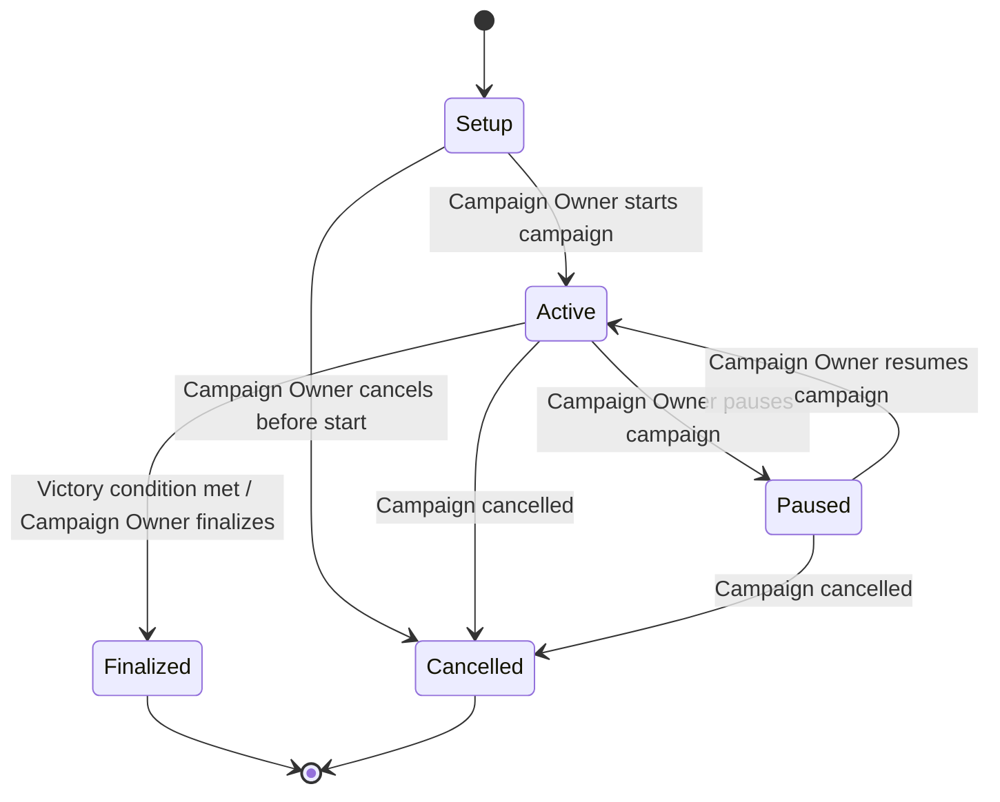
```mermaid
stateDiagram-v2
    [*] --> Setup
    Setup --> Active: Campaign Owner starts campaign
    Setup --> Cancelled: Campaign Owner cancels before start
    Active --> Paused: Campaign Owner pauses campaign
    Paused --> Active: Campaign Owner resumes campaign
    Active --> Finalized: Victory condition met / Campaign Owner finalizes
    Active --> Cancelled: Campaign cancelled
    Paused --> Cancelled: Campaign cancelled
    Finalized --> [*]
    Cancelled --> [*]
```

## 3.4 Rules

* Campaigns begin in `setup`.
* Campaigns should not allow normal battle progression until `active`.
* Setup actions include inviting players, accepting invitations, assigning forces, configuring objectives, and configuring campaign rules.
* Finalized campaigns should be read-only except for allowed actions such as viewing, exporting, or adding notes.
* Cancelled campaigns should preserve records for history unless explicitly deleted by administrative action.

---

# 4. Campaign Invitation Lifecycle

## 4.1 Description

Campaign invitations are sent by the Campaign Owner to friends or eligible users.

## 4.2 States

| State     | Meaning                                  |
| --------- | ---------------------------------------- |
| pending   | Invitation was sent and awaits response. |
| accepted  | User accepted the invitation.            |
| declined  | User declined the invitation.            |
| cancelled | Campaign Owner cancelled invitation.     |
| expired   | Invitation is no longer valid.           |

## 4.3 Diagram

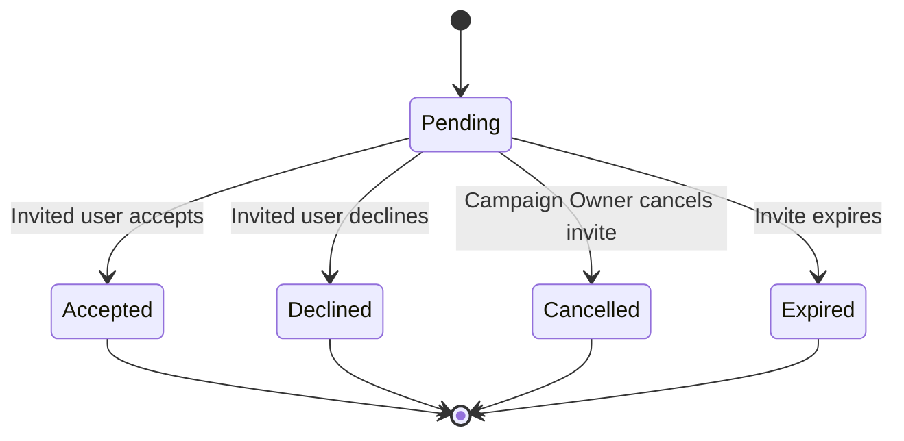
```mermaid
stateDiagram-v2
    [*] --> Pending
    Pending --> Accepted: Invited user accepts
    Pending --> Declined: Invited user declines
    Pending --> Cancelled: Campaign Owner cancels invite
    Pending --> Expired: Invite expires
    Accepted --> [*]
    Declined --> [*]
    Cancelled --> [*]
    Expired --> [*]
```

## 4.4 Rules

* Accepted invitations should create or activate a campaign participant record.
* A user may need to assign an eligible force before fully joining the campaign.
* Duplicate invitations to the same active user/campaign pair should be prevented.

---

# 5. Original Force Lifecycle

## 5.1 Description

An original force is a user-created force outside a campaign. It serves as a reusable template and can be copied into campaigns.

## 5.2 States

| State    | Meaning                                             |
| -------- | --------------------------------------------------- |
| draft    | Force is being created and may be incomplete.       |
| active   | Force is available for use and campaign assignment. |
| archived | Force is hidden from normal lists but preserved.    |
| deleted  | Force is soft-deleted or removed from normal use.   |

## 5.3 Diagram

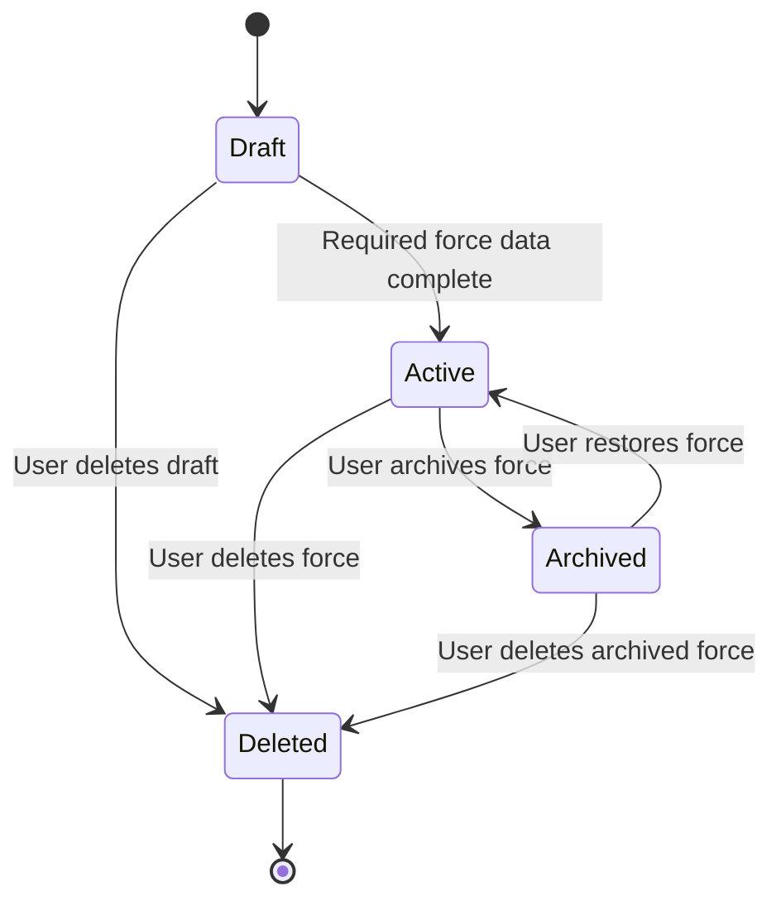
```mermaid
stateDiagram-v2
    [*] --> Draft
    Draft --> Active: Required force data complete
    Draft --> Deleted: User deletes draft
    Active --> Archived: User archives force
    Archived --> Active: User restores force
    Active --> Deleted: User deletes force
    Archived --> Deleted: User deletes archived force
    Deleted --> [*]
```

## 5.4 Rules

* Original forces are user-owned templates.
* Original forces may be copied into campaigns.
* Once copied, campaign-specific force records are independent.
* Deleting or archiving the original force must not delete campaign-specific force copies.

---

# 6. Campaign-Specific Force Lifecycle

## 6.1 Description

A campaign-specific force is created when a player assigns an original force to a campaign. It becomes the persistent campaign version of that force.

## 6.2 States

| State         | Meaning                                                          |
| ------------- | ---------------------------------------------------------------- |
| pending_setup | Force is copied but campaign setup is not complete.              |
| active        | Force is participating in the campaign.                          |
| defeated      | Force can no longer continue due to campaign rules.              |
| surrendered   | Player or force surrendered.                                     |
| archived      | Campaign is complete or force is no longer active but preserved. |

## 6.3 Diagram

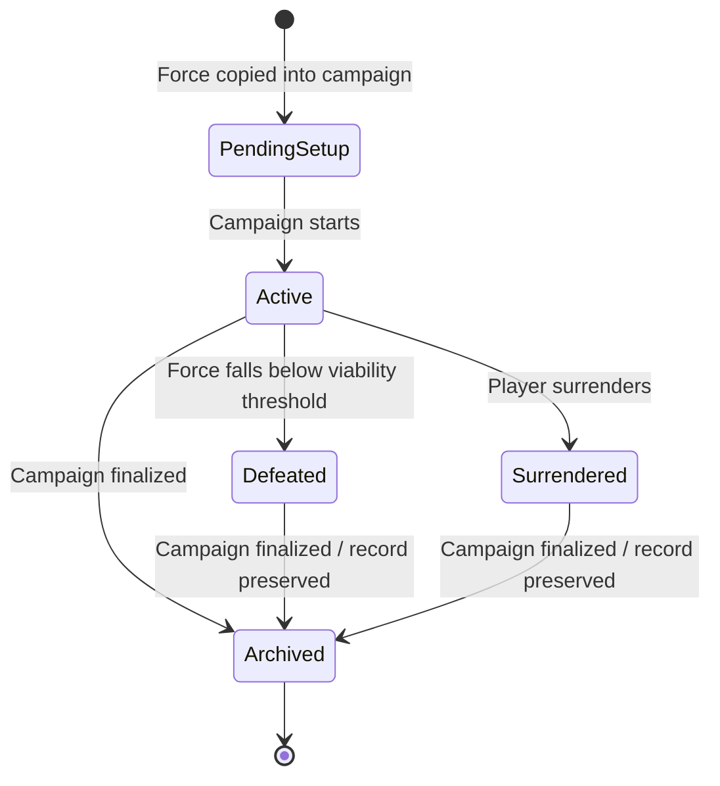
```mermaid
stateDiagram-v2
    [*] --> PendingSetup: Force copied into campaign
    PendingSetup --> Active: Campaign starts
    Active --> Defeated: Force falls below viability threshold
    Active --> Surrendered: Player surrenders
    Active --> Archived: Campaign finalized
    Defeated --> Archived: Campaign finalized / record preserved
    Surrendered --> Archived: Campaign finalized / record preserved
    Archived --> [*]
```

## 6.4 Rules

* Campaign-specific force records should preserve the force state at the time it joined the campaign.
* Campaign-specific forces track campaign damage, repairs, kills, readiness, actual BV, and full BV.
* Campaign-specific forces should usually not be deleted because they are part of campaign history.

---

# 7. Campaign Unit Lifecycle

## 7.1 Description

A campaign unit is a campaign-specific copy of a unit. Its state changes as battles, repairs, salvage, and campaign events occur.

## 7.2 States

| State       | Meaning                                                 |
| ----------- | ------------------------------------------------------- |
| active      | Unit is available for battle.                           |
| damaged     | Unit is damaged but may still be usable.                |
| repairing   | Unit is undergoing repairs.                             |
| unavailable | Unit cannot participate temporarily.                    |
| destroyed   | Unit is destroyed.                                      |
| captured    | Unit has been captured by another force.                |
| salvaged    | Unit has been recovered as salvage.                     |
| retired     | Unit is removed from active campaign use but preserved. |

## 7.3 Diagram

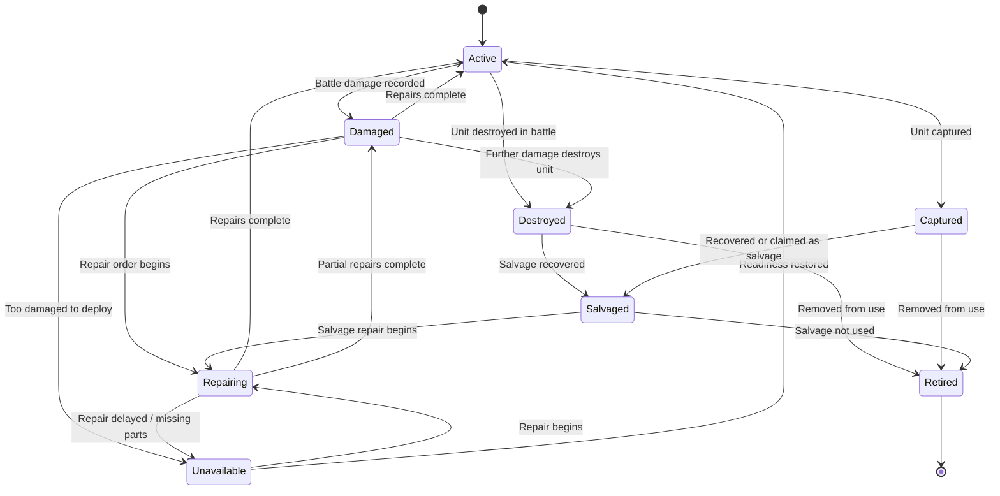
```mermaid
stateDiagram-v2
    [*] --> Active
    Active --> Damaged: Battle damage recorded
    Active --> Destroyed: Unit destroyed in battle
    Active --> Captured: Unit captured
    Damaged --> Active: Repairs complete
    Damaged --> Repairing: Repair order begins
    Damaged --> Destroyed: Further damage destroys unit
    Damaged --> Unavailable: Too damaged to deploy
    Repairing --> Active: Repairs complete
    Repairing --> Damaged: Partial repairs complete
    Repairing --> Unavailable: Repair delayed / missing parts
    Unavailable --> Repairing: Repair begins
    Unavailable --> Active: Readiness restored
    Destroyed --> Salvaged: Salvage recovered
    Destroyed --> Retired: Removed from use
    Captured --> Salvaged: Recovered or claimed as salvage
    Captured --> Retired: Removed from use
    Salvaged --> Repairing: Salvage repair begins
    Salvaged --> Retired: Salvage not used
    Retired --> [*]
```

## 7.4 Rules

* Actual BV may decrease when a unit is damaged or unavailable.
* Full BV remains the unit's fully repaired value.
* Destroyed, captured, salvaged, and retired units should remain in history.
* Repair rules vary by campaign type.

---

# 8. Battle Lifecycle

## 8.1 Description

A battle starts as a draft or generated record, becomes pending after submission, and then becomes confirmed, disputed, voided, or corrected.

## 8.2 States

| State                | Meaning                                                          |
| -------------------- | ---------------------------------------------------------------- |
| draft                | Battle record exists but is not submitted.                       |
| pending_confirmation | Battle result is submitted and awaits confirmation.              |
| confirmed            | Battle result is accepted and campaign state is updated.         |
| disputed             | Battle result is challenged.                                     |
| corrected            | Battle result was corrected after dispute or review.             |
| voided               | Battle record is invalidated and does not affect campaign state. |

## 8.3 Diagram

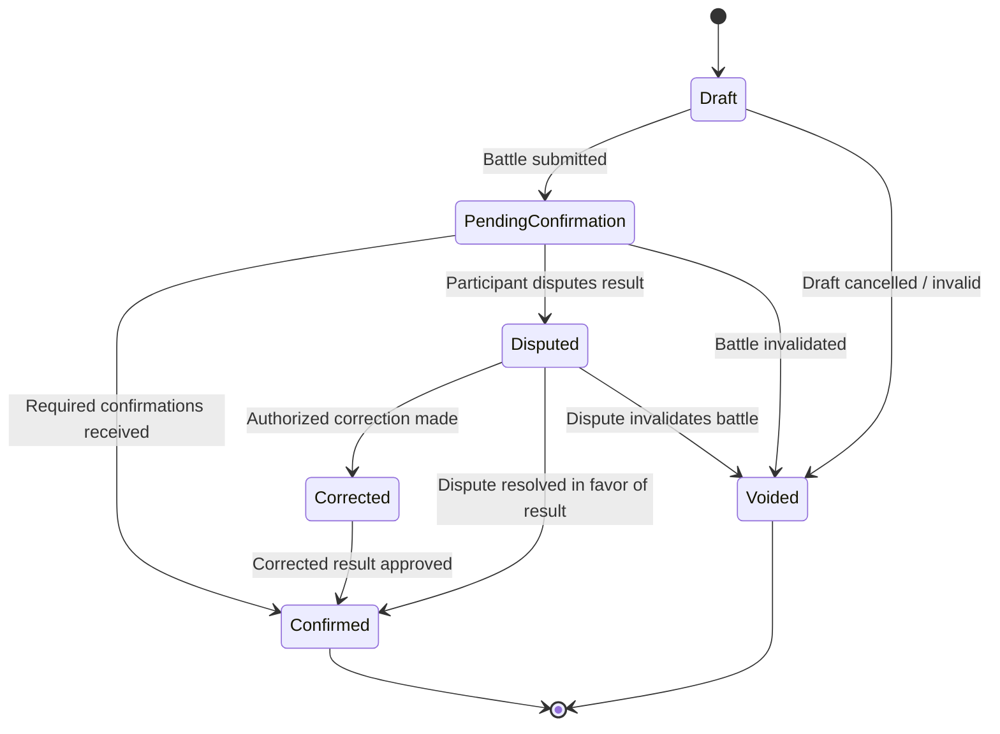
```mermaid
stateDiagram-v2
    [*] --> Draft
    Draft --> PendingConfirmation: Battle submitted
    Draft --> Voided: Draft cancelled / invalid
    PendingConfirmation --> Confirmed: Required confirmations received
    PendingConfirmation --> Disputed: Participant disputes result
    PendingConfirmation --> Voided: Battle invalidated
    Disputed --> Corrected: Authorized correction made
    Disputed --> Confirmed: Dispute resolved in favor of result
    Disputed --> Voided: Dispute invalidates battle
    Corrected --> Confirmed: Corrected result approved
    Confirmed --> [*]
    Voided --> [*]
```

## 8.4 Rules

* Pending battles may show projected campaign effects.
* Confirmed battles update campaign state.
* Disputed battles should not finalize campaign effects until resolved.
* Confirmed battles should not be modified except through authorized correction workflows.

---

# 9. Battle Submission Lifecycle

## 9.1 Description

Battle submissions support single-submit and dual-submit confirmation models.

## 9.2 States

| State     | Meaning                                       |
| --------- | --------------------------------------------- |
| draft     | Submission is being prepared.                 |
| submitted | Submission has been entered.                  |
| matched   | Submission matches required comparison data.  |
| conflict  | Submission conflicts with another submission. |
| corrected | Submission has been corrected.                |
| withdrawn | Submission was withdrawn or invalidated.      |

## 9.3 Diagram

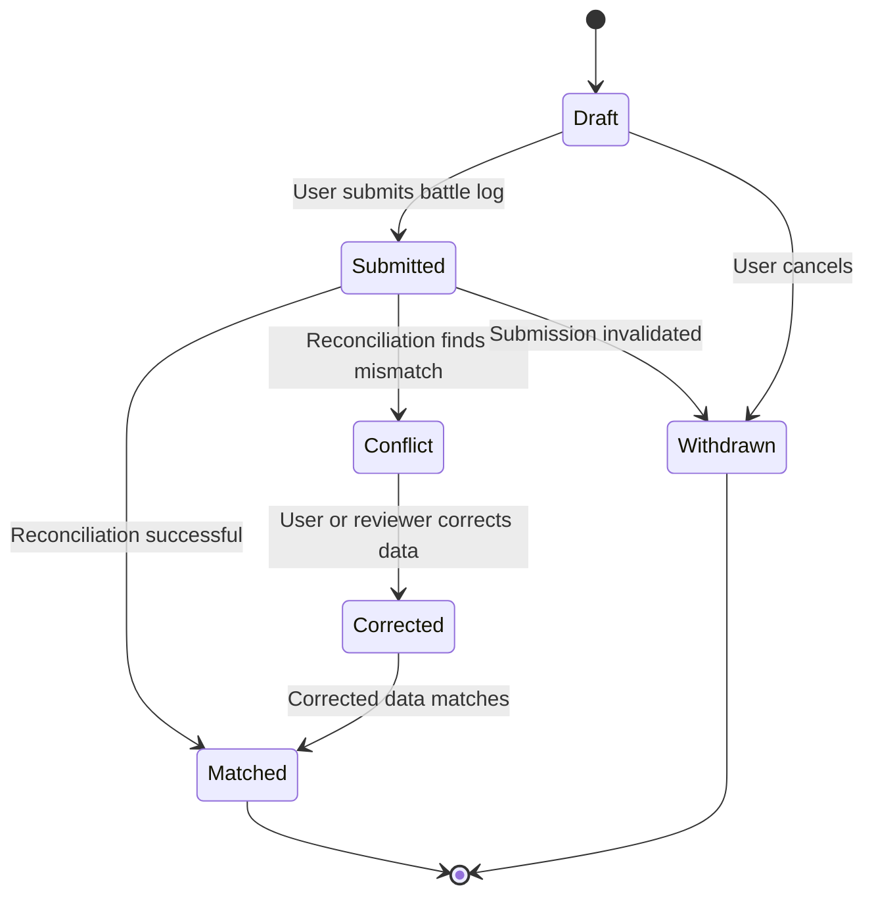
```mermaid
stateDiagram-v2
    [*] --> Draft
    Draft --> Submitted: User submits battle log
    Draft --> Withdrawn: User cancels
    Submitted --> Matched: Reconciliation successful
    Submitted --> Conflict: Reconciliation finds mismatch
    Conflict --> Corrected: User or reviewer corrects data
    Corrected --> Matched: Corrected data matches
    Submitted --> Withdrawn: Submission invalidated
    Matched --> [*]
    Withdrawn --> [*]
```

## 9.4 Rules

* Single-submit campaigns may not need multiple submissions.
* Dual-submit campaigns compare submissions before confirmation.
* Conflicts should identify mismatched fields such as winner, damage, destroyed units, or objective result.

---

# 10. Battle Dispute Lifecycle

## 10.1 Description

A dispute records a challenge to a battle result.

## 10.2 States

| State        | Meaning                                         |
| ------------ | ----------------------------------------------- |
| open         | Dispute has been submitted.                     |
| under_review | Campaign Owner or authorized user is reviewing. |
| resolved     | Dispute was resolved.                           |
| rejected     | Dispute was rejected.                           |
| cancelled    | User cancelled dispute before resolution.       |

## 10.3 Diagram

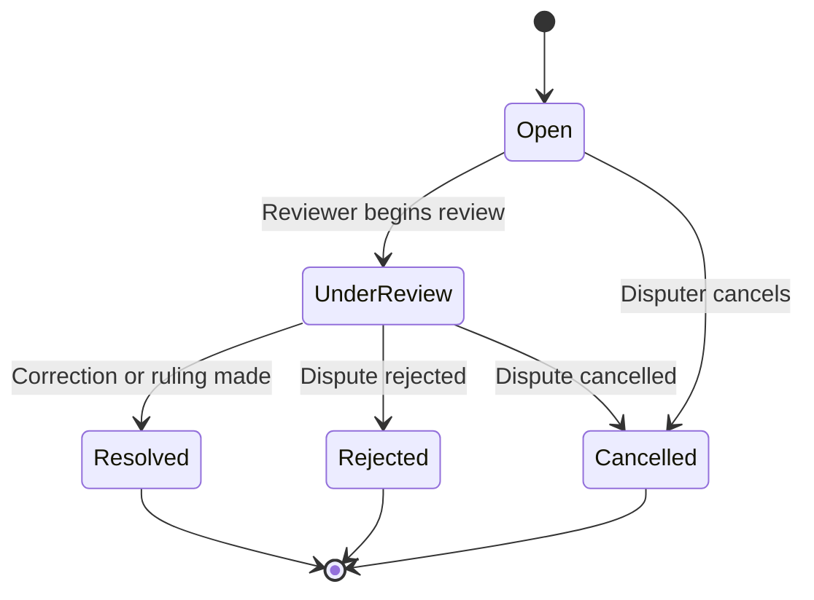
```mermaid
stateDiagram-v2
    [*] --> Open
    Open --> UnderReview: Reviewer begins review
    Open --> Cancelled: Disputer cancels
    UnderReview --> Resolved: Correction or ruling made
    UnderReview --> Rejected: Dispute rejected
    UnderReview --> Cancelled: Dispute cancelled
    Resolved --> [*]
    Rejected --> [*]
    Cancelled --> [*]
```

## 10.4 Rules

* Open disputes should prevent battle finalization unless campaign rules allow otherwise.
* Resolution should record notes and reviewer identity.
* Resolving a dispute may confirm, correct, or void a battle.

---

# 11. Objective Control Lifecycle

## 11.1 Description

Objective control changes during setup, battle confirmation, Conquest order resolution, or authorized adjustments.

## 11.2 States

Objective control is not a simple single-state object, but objectives can have control states such as:

| State        | Meaning                                                                      |
| ------------ | ---------------------------------------------------------------------------- |
| neutral      | No player currently controls objective.                                      |
| controlled   | One player controls objective.                                               |
| contested    | Multiple players hold meaningful control or are fighting over the objective. |
| bonus_active | Objective bonus is active for one or more eligible players.                  |
| bonus_denied | Objective bonus is temporarily denied by raid or rule effect.                |

## 11.3 Diagram

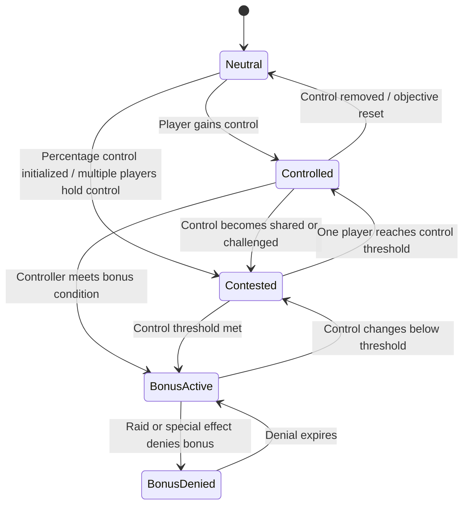
```mermaid
stateDiagram-v2
    [*] --> Neutral
    Neutral --> Controlled: Player gains control
    Neutral --> Contested: Percentage control initialized / multiple players hold control
    Controlled --> Contested: Control becomes shared or challenged
    Contested --> Controlled: One player reaches control threshold
    Controlled --> Neutral: Control removed / objective reset
    Controlled --> BonusActive: Controller meets bonus condition
    BonusActive --> BonusDenied: Raid or special effect denies bonus
    BonusDenied --> BonusActive: Denial expires
    BonusActive --> Contested: Control changes below threshold
    Contested --> BonusActive: Control threshold met
```

## 11.4 Rules

* Binary control generally switches between neutral and controlled.
* Percentage control may remain contested for much of the campaign.
* Objective control history should record before and after states.
* Bonus ownership should update when control thresholds change.

---

# 12. Resource Transaction Lifecycle

## 12.1 Description

Resource transactions record changes to Warchest Points, c-bills, or other campaign resources.

## 12.2 States

| State    | Meaning                                    |
| -------- | ------------------------------------------ |
| pending  | Transaction is proposed but not applied.   |
| applied  | Transaction has updated the balance.       |
| reversed | Transaction was reversed by correction.    |
| voided   | Transaction was cancelled before applying. |

## 12.3 Diagram

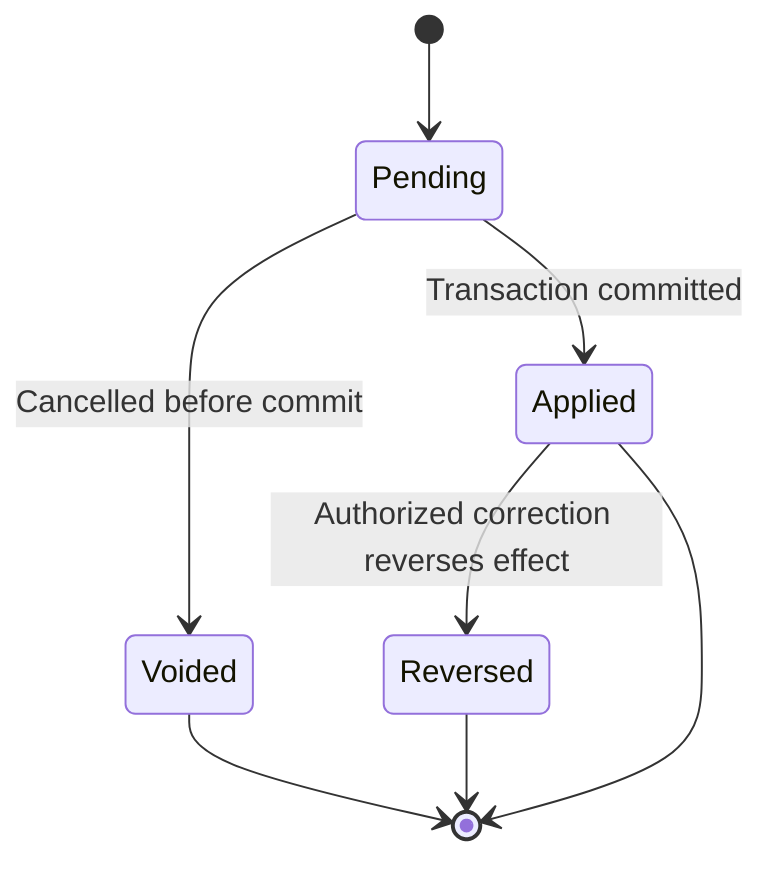
```mermaid
stateDiagram-v2
    [*] --> Pending
    Pending --> Applied: Transaction committed
    Pending --> Voided: Cancelled before commit
    Applied --> Reversed: Authorized correction reverses effect
    Voided --> [*]
    Reversed --> [*]
    Applied --> [*]
```

## 12.4 Rules

* Resource changes from confirmed battles should only apply after confirmation.
* Resource transactions should preserve an audit trail.
* Reversals should create a new reversing transaction rather than deleting the original when possible.

---

# 13. Repair Order Lifecycle

## 13.1 Description

Repair orders represent broad repair, rearmament, or recovery actions selected by a player.

## 13.2 States

| State       | Meaning                                                        |
| ----------- | -------------------------------------------------------------- |
| planned     | Repair has been selected but not resolved.                     |
| in_progress | Repair is currently being processed or occupies campaign time. |
| completed   | Repair is finished.                                            |
| failed      | Repair attempt failed.                                         |
| delayed     | Repair could not complete due to time, parts, or failed roll.  |
| cancelled   | Repair order was cancelled.                                    |

## 13.3 Diagram

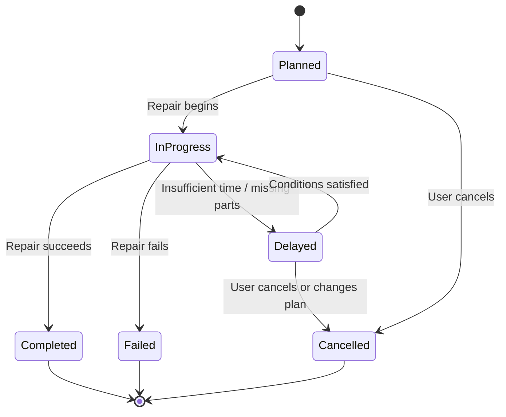
```mermaid
stateDiagram-v2
    [*] --> Planned
    Planned --> InProgress: Repair begins
    Planned --> Cancelled: User cancels
    InProgress --> Completed: Repair succeeds
    InProgress --> Failed: Repair fails
    InProgress --> Delayed: Insufficient time / missing parts
    Delayed --> InProgress: Conditions satisfied
    Delayed --> Cancelled: User cancels or changes plan
    Completed --> [*]
    Failed --> [*]
    Cancelled --> [*]
```

## 13.4 Rules

* Chaos campaigns may skip most repair order complexity and resolve full repairs directly through resource spending.
* Advanced and Conquest campaigns may use repair priorities and time.
* Repair orders may generate repair order items for unit-level results.

---

# 14. Requisition Lifecycle

## 14.1 Description

Requisition requests represent attempts to acquire parts, units, weapons, components, pilots, or supplies.

## 14.2 States

| State     | Meaning                                            |
| --------- | -------------------------------------------------- |
| pending   | Request is waiting for resolution.                 |
| approved  | Request was accepted but may not be delivered yet. |
| denied    | Request failed or was rejected.                    |
| delayed   | Request succeeded but delivery is delayed.         |
| fulfilled | Requested item was delivered.                      |
| cancelled | Request was cancelled.                             |

## 14.3 Diagram

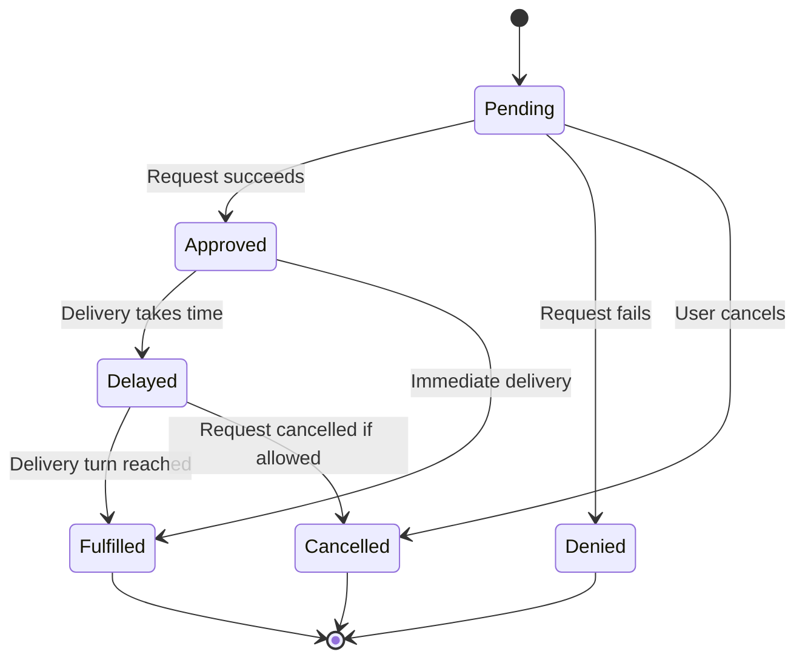
```mermaid
stateDiagram-v2
    [*] --> Pending
    Pending --> Approved: Request succeeds
    Pending --> Denied: Request fails
    Pending --> Cancelled: User cancels
    Approved --> Delayed: Delivery takes time
    Approved --> Fulfilled: Immediate delivery
    Delayed --> Fulfilled: Delivery turn reached
    Delayed --> Cancelled: Request cancelled if allowed
    Fulfilled --> [*]
    Denied --> [*]
    Cancelled --> [*]
```

## 14.4 Rules

* Requisition may be affected by faction, era, availability rating, objective bonuses, campaign type, and settings.
* Fulfilled requisitions may create resource transactions or update repair availability.

---

# 15. Conquest Turn Lifecycle

## 15.1 Description

Conquest turns manage strategic map play. Players assign orders, the system resolves them, and battles may be generated.

## 15.2 States

| State              | Meaning                                                                 |
| ------------------ | ----------------------------------------------------------------------- |
| waiting_for_orders | Players are assigning combat team orders.                               |
| orders_submitted   | Required orders are submitted.                                          |
| resolving          | System is resolving order effects.                                      |
| battles_pending    | One or more battles must be played or confirmed before turn completion. |
| completed          | Turn is fully resolved.                                                 |
| blocked            | Turn cannot proceed due to invalid data or dispute.                     |

## 15.3 Diagram

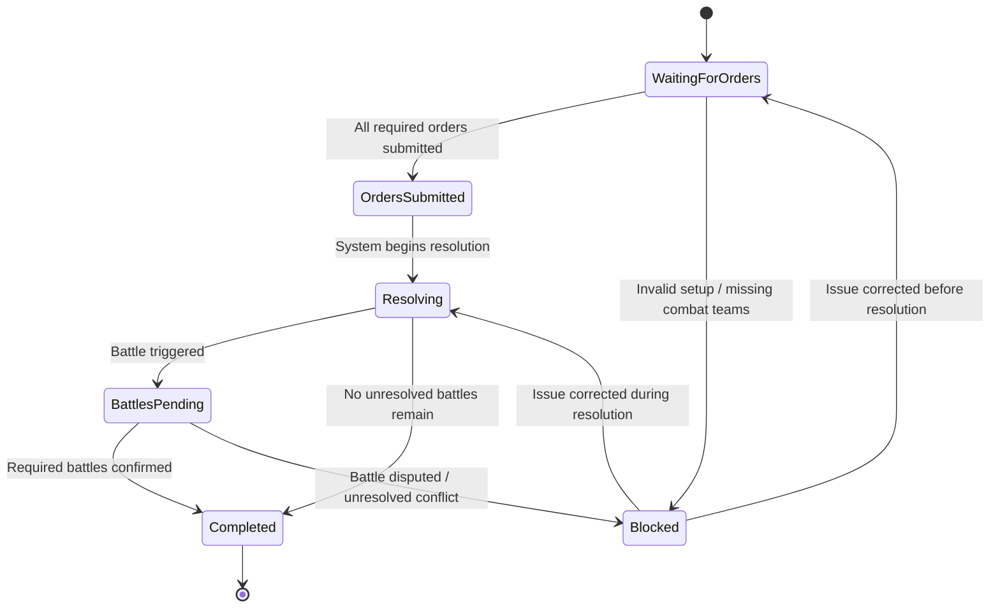
```mermaid
stateDiagram-v2
    [*] --> WaitingForOrders
    WaitingForOrders --> OrdersSubmitted: All required orders submitted
    WaitingForOrders --> Blocked: Invalid setup / missing combat teams
    OrdersSubmitted --> Resolving: System begins resolution
    Resolving --> BattlesPending: Battle triggered
    Resolving --> Completed: No unresolved battles remain
    BattlesPending --> Completed: Required battles confirmed
    BattlesPending --> Blocked: Battle disputed / unresolved conflict
    Blocked --> WaitingForOrders: Issue corrected before resolution
    Blocked --> Resolving: Issue corrected during resolution
    Completed --> [*]
```

## 15.4 Rules

* Both Conquest players must submit orders before normal resolution.
* If battles are triggered, final state changes may depend on battle confirmation.
* A turn may remain blocked if an invalid order or unresolved battle prevents completion.

---

# 16. Conquest Order Lifecycle

## 16.1 Description

A Conquest order is assigned to a combat team during a Conquest turn.

## 16.2 States

| State     | Meaning                                 |
| --------- | --------------------------------------- |
| draft     | Order is being selected.                |
| submitted | Player submitted the order.             |
| locked    | Order cannot be changed.                |
| resolved  | Order has been processed.               |
| cancelled | Order was cancelled before resolution.  |
| invalid   | Order is invalid and must be corrected. |

## 16.3 Diagram

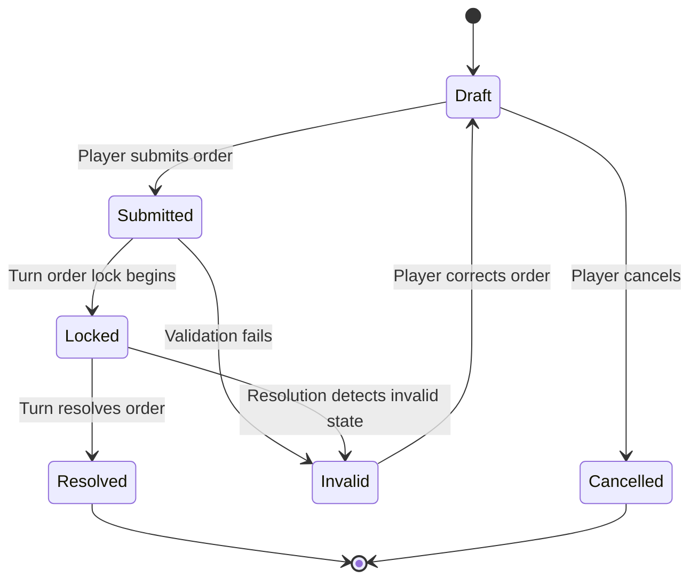
```mermaid
stateDiagram-v2
    [*] --> Draft
    Draft --> Submitted: Player submits order
    Draft --> Cancelled: Player cancels
    Submitted --> Locked: Turn order lock begins
    Submitted --> Invalid: Validation fails
    Invalid --> Draft: Player corrects order
    Locked --> Resolved: Turn resolves order
    Locked --> Invalid: Resolution detects invalid state
    Resolved --> [*]
    Cancelled --> [*]
```

## 16.4 Rules

* Each combat team should receive one order per Conquest turn.
* Orders should be validated before submission and again before resolution.
* Locked orders should usually not be editable unless campaign rules allow unlocking.

---

# 17. Notification Lifecycle

## 17.1 Description

Notifications alert users to invitations, battle confirmations, disputes, objective changes, Conquest turns, and other events.

## 17.2 States

| State     | Meaning                                               |
| --------- | ----------------------------------------------------- |
| unread    | Notification has not been read.                       |
| read      | User has opened or marked notification read.          |
| archived  | Notification is hidden from normal view but retained. |
| dismissed | Notification has been dismissed.                      |

## 17.3 Diagram

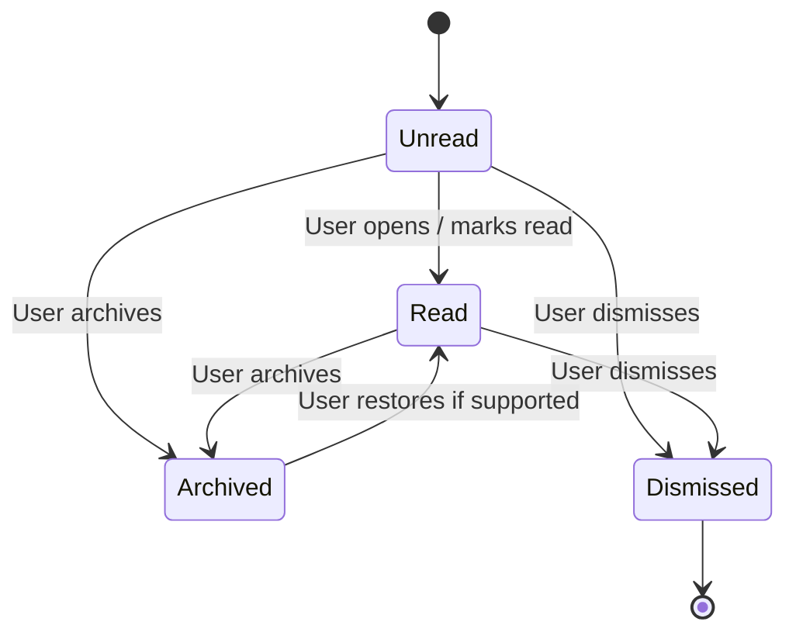
```mermaid
stateDiagram-v2
    [*] --> Unread
    Unread --> Read: User opens / marks read
    Unread --> Archived: User archives
    Unread --> Dismissed: User dismisses
    Read --> Archived: User archives
    Read --> Dismissed: User dismisses
    Archived --> Read: User restores if supported
    Dismissed --> [*]
```

## 17.4 Rules

* Notifications should link to related campaign, battle, invitation, objective, or Conquest turn records where applicable.
* Read/unread status should be user-specific.
* Dismissed or archived notifications should not delete related source records.

---

# 18. Cross-Cutting State Rules

## 18.1 Setup vs. Active Campaign Actions

Some actions should only be allowed in setup:

* Major campaign type selection.
* Core campaign rule configuration.
* Initial force assignment.
* Initial Conquest map setup.

Some actions should only be allowed after campaign start:

* Logging normal battles.
* Spending campaign resources.
* Assigning Conquest orders.
* Resolving turns.

## 18.2 Pending vs. Confirmed Effects

Pending effects should be shown as projections where helpful, but should not permanently alter campaign state until confirmed.

Examples:

* Pending battle damage.
* Pending objective control swing.
* Pending resource changes.
* Pending Conquest battle results.

## 18.3 Finalized Campaign Restrictions

Finalized campaigns should be mostly read-only.

Allowed actions may include:

* Viewing campaign history.
* Viewing battle records.
* Viewing final standings.
* Exporting results.
* Adding allowed notes.

Disallowed actions should include:

* Creating new battles.
* Changing campaign settings.
* Changing objective control.
* Spending resources.
* Assigning Conquest orders.

## 18.4 Auditability

Important state changes should be auditable, especially:

* Battle confirmation.
* Battle disputes.
* Objective control changes.
* Resource transactions.
* Repair results.
* Requisition results.
* Conquest turn resolution.
* Campaign finalization.

---

# 19. MVP State Model

For the first implementation, the following states are probably enough.

## 19.1 Campaign

* setup
* active
* finalized
* cancelled

## 19.2 Battle

* draft
* pending_confirmation
* confirmed
* disputed
* voided

## 19.3 Force

* active
* archived
* deleted

## 19.4 Campaign Unit

* active
* damaged
* destroyed
* unavailable
* repairing

## 19.5 Notification

* unread
* read
* archived

## 19.6 Conquest Turn

Can be deferred until Conquest implementation.

---

# 20. Open Questions

## 20.1 Campaign Pause

Should campaign pause be included in the first implementation, or is setup/active/finalized/cancelled enough?

## 20.2 Battle Corrections

Should confirmed battle corrections be supported in the first implementation, or should they require admin/database intervention?

## 20.3 Dual Submission Timing

If dual-submit reconciliation is enabled, should the battle exist before both submissions, or should each submission create a candidate battle that is later merged?

Recommended first implementation: one battle record exists, and submissions attach to it.

## 20.4 Objective Control Neutral State

For percentage control, should unowned/neutral control be represented as:

1. A neutral pseudo-participant.
2. Missing percentage not owned by any player.
3. Always distributed among players.

Recommended first implementation: always distribute objective control among players for percentage control.

## 20.5 Conquest Turn Blocking

If one triggered battle is disputed, does the whole Conquest turn remain blocked, or only the affected hex/objective results?

Recommended first implementation: block the whole turn until the battle is resolved.

---

# 21. Next Design Step

The next design document should be an **API Endpoint Plan**.

The API plan should map:

* Use cases to endpoints.
* Endpoints to database entities.
* Request/response payloads.
* Permission rules.
* State transitions triggered by each endpoint.

Recommended sections:

1. Authentication endpoints.
2. Friend endpoints.
3. Force endpoints.
4. Campaign endpoints.
5. Campaign setup endpoints.
6. Objective endpoints.
7. Battle endpoints.
8. Resource and repair endpoints.
9. Conquest endpoints.
10. Notification endpoints.
11. Leaderboard/statistics endpoints.
